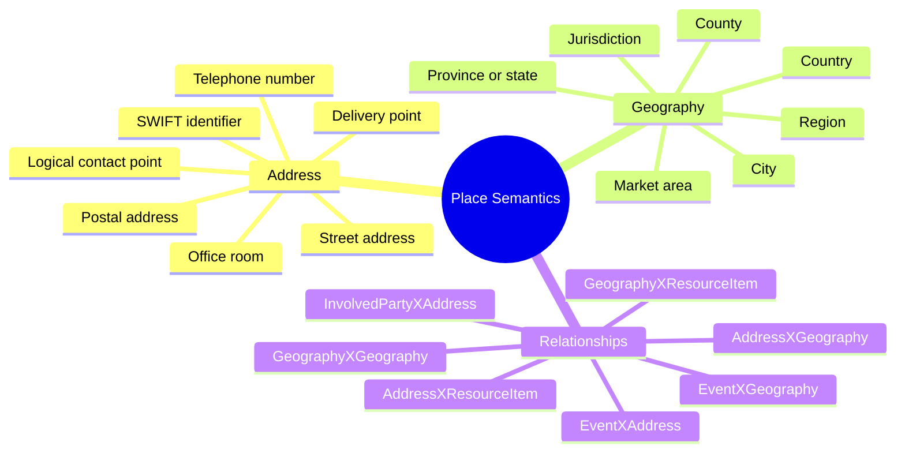

# 📍 Address & Geography

> **Address** stores concrete or logical contact/place values. **Geography** stores bounded places, jurisdictions, regions, and geographic areas.

ActivityMaster intentionally separates place information into two cleaner concepts:

- **Address** for concrete or logical values such as street addresses, postal addresses, telephone numbers, SWIFT identifiers, office rooms, delivery points, or other contactable points.
- **Geography** for countries, provinces, cities, counties, regions, jurisdictions, market areas, legal territories, and other bounded places.

This keeps the model practical without recreating a large number of address-component tables too early.

---

## 🧭 Why the Split Matters

A single business phrase like “where something happens” can mean very different things:

| Business question | ActivityMaster concept |
|---|---|
| Where should a statement be sent? | `Address` |
| What telephone number should be used? | `Address` |
| What SWIFT or routing point is used? | `Address` |
| In which country is this party incorporated? | `Geography` |
| Which jurisdiction governs an agreement? | `Geography` |
| Which region is a product offered in? | `Geography` |
| Where is a physical asset stored? | `Address` if exact place; `Geography` if broad area. |

The split also prevents address values from carrying legal, regional, or hierarchical geography responsibilities.

---

## 🧩 ActivityMaster Implementation Shape

| ActivityMaster element | Purpose |
|---|---|
| `Address` | Stores the address/contact/logical-place value. |
| `Geography` | Stores a named geographic or jurisdictional area. |
| `AddressXClassification` | Adds additional address semantics, such as component meaning, validation status, usage, or source quality. |
| `AddressXGeography` | Connects an address to its city, region, country, jurisdiction, or other geographic area. |
| `AddressXResourceItem` | Links supporting documents or artefacts to an address. |
| `GeographyXClassification` | Classifies geography type, role, jurisdiction category, or market-area meaning. |
| `GeographyXGeography` | Creates geographic hierarchy, such as country -> province -> city. |
| `GeographyXResourceItem` | Links maps, documents, permits, certificates, or other resources to a geography. |
| `InvolvedPartyXAddress` | Assigns an address to a person, organisation, organisation unit, or employment position. |
| `EventXAddress` | Assigns concrete/logical address context to an event. |
| `EventXGeography` | Assigns regional, jurisdictional, or bounded-place context to an event. |
| `GeographyHierarchyView` | Supports hierarchy browsing for geographic structures. |

---

## 🧱 Core Columns

### Address

| Meaning | Column |
|---|---|
| Primary key | `AddressID` |
| Address/contact value | `Value` |
| Address type | `ClassificationID` |
| Effective from | `EffectiveFromDate` |
| Effective to | `EffectiveToDate` |
| Owning enterprise | `EnterpriseID` |
| Active / deleted / archived state | `ActiveFlagID` |
| Owning system | `SystemID` |

`Value` is encrypted at rest, which makes `Address` the right target for contactable or personally identifying place values.

### Geography

| Meaning | Column |
|---|---|
| Primary key | `GeographyID` |
| Name | `GeographyName` |
| Description | `GeographyDesc` |
| Geography type | `ClassificationID` |
| Effective from | `EffectiveFromDate` |
| Effective to | `EffectiveToDate` |
| Owning enterprise | `EnterpriseID` |
| Active / deleted / archived state | `ActiveFlagID` |
| Owning system | `SystemID` |

---

## 🧠 Address / Geography Mental Model



---

## 🗺️ Mapping Rules

| Semantic meaning | ActivityMaster representation |
|---|---|
| Street address, office room, PO box, telephone number, SWIFT number, or other contact/logical point | `Address` with `ClassificationID = AddressTypes` and `Value = <encrypted value>` |
| Country, province, state, city, county, region, legal territory, jurisdiction, market area, or bounded place | `Geography` with `ClassificationID = GeographyTypes` |
| Address located in a city/country/region | `AddressXGeography` with `ClassificationID = AddressGeographyRelationships`, `Value = Located In` |
| Geography hierarchy | `GeographyXGeography` with `ClassificationID = GeographyRelationships`, `Value = Contains` / `Is Part Of` |
| Party mailing/residential/contact point | `InvolvedPartyXAddress` with `ClassificationID = InvolvedPartyAddressRoles`, `Value = Mailing Address`, `Residential Address`, `Contact Number`, etc. |
| Event occurs at an exact place or contact point | `EventXAddress` with `ClassificationID = EventAddressRelationships`, `Value = Occurs At`, `Originates From`, `Sends To`, etc. |
| Event occurs in, originates from, or is governed by a region/jurisdiction | `EventXGeography` with `ClassificationID = EventGeographyRelationships`, `Value = Occurs In`, `Originates From`, `Has Tax Jurisdiction Of`, etc. |
| Supporting proof or documentation | `AddressXResourceItem` or `GeographyXResourceItem` |

---

## 🏠 Address Examples

| Example value | Suggested `Address` classification | Notes |
|---|---|---|
| `1345 Broad Street` | `Street Address` | Concrete physical address. |
| `PO Box 97, Johannesburg` | `Postal Address` | Address value; link to `Geography` = Johannesburg. |
| `881-4911` | `Telephone Number` | Logical/contact address. |
| `2 Main Street` | `Street Address` | Can be referenced by a model-based rule. |
| `City Center location of Bank ABC` | `Branch Address` or `Service Point Address` | Exact value should be stored as `Address`; region/city should be linked via `AddressXGeography`. |
| `SWIFT payment order address` | `SWIFT Identifier` or `Payment Routing Address` | Needs seed classification confirmation. |

---

## 🌍 Geography Examples

| Example value | Suggested `Geography` classification | Notes |
|---|---|---|
| `Germany` | `Country` | Bounded geopolitical area. |
| `South Africa` | `Country` | Bounded geopolitical area. |
| `Johannesburg` | `City` | Can be linked from many addresses. |
| `Virginia` | `State / Province` | Can be used for legal validity or jurisdiction. |
| `Commonwealth of Virginia` | `Jurisdiction` | Used where laws/governing authority matter. |
| `Fairfax County` | `County` / `Jurisdiction` | Legal or administrative area. |
| `North East Region` | `Region` / `Market Area` | Useful for product availability and campaign targeting. |
| `Southwest region of South Africa` | `Region` / `Market Area` | Useful for segmentation. |
| `Pretoria` | `City` / `Tax Jurisdiction` depending usage | Context determines the classification bucket. |

---

## 🧬 Address Components

The uploaded address diagram shows a component-style address structure:

```text
Address
  -> Address Component
      -> Address Component Type
  -> Address Type
```

ActivityMaster currently simplifies this:

| Component-style meaning | ActivityMaster representation |
|---|---|
| Full usable address value | `Address.Value` |
| Address type | `Address.ClassificationID` |
| Address component type | `AddressXClassification` with `ClassificationID = AddressComponentTypes` |
| Address component value | `AddressXClassification.Value` or a future component entity if strict parsing is needed |
| Sequence/order of components | Gap / future enhancement |

### Suggested component values

These are useful seed candidates if component-level parsing becomes important:

- `Building Number`
- `Street Name`
- `Suburb`
- `City`
- `Province`
- `Postal Code`
- `Country`
- `Telephone Country Code`
- `Telephone Area Code`
- `Telephone Number`
- `SWIFT Code`
- `Branch Code`

### Gap

There is no dedicated `AddressComponent` entity in the current ActivityMaster entity list. That is acceptable for a simplified canonical model, but exact component ordering, component validity, and postal-format generation would need either `AddressXClassification` conventions or a new component entity later.

---

## 🔗 Common Relationship Values

### Involved party address roles

Use `InvolvedPartyXAddress` with `ClassificationID = InvolvedPartyAddressRoles`.

| Value | Meaning |
|---|---|
| `Mailing Address` | Address used for correspondence. |
| `Residential Address` | Address where a person resides. |
| `Business Address` | Address where a business or organisation unit operates. |
| `Contact Number` | Telephone or similar contact point. |
| `Registered Address` | Formal legal address for an organisation. |
| `Incorporated In` | Prefer `Geography` when the meaning is jurisdiction or country of incorporation. |

### Event address / geography roles

Use `EventXAddress` for concrete address values and `EventXGeography` for broad areas.

| Value | Prefer | Meaning / example |
|---|---|---|
| `Occurs At` | `EventXAddress` | A meeting, appointment, inspection, or branch event occurs at a concrete address. |
| `Occurs In` | `EventXGeography` | A fire, concert, campaign, or civil event occurs in a city, region, or country. |
| `Originates From` | `EventXAddress` or `EventXGeography` | A letter from a PO Box uses `Address`; a promotion from a region uses `Geography`. |
| `Sends To` | `EventXAddress` | Funds, documents, or messages are sent to a concrete destination. |
| `Has Tax Jurisdiction Of` | `EventXGeography` | Tax jurisdiction is geographic/legal, not an address value. |
| `Maintains` | `EventXAddress` or `EventXGeography` | Maintenance event updates an address or geography record. |

### Product availability roles

The product source semantics include values such as:

| Value | Meaning | Suggested ActivityMaster handling |
|---|---|---|
| `Is Offered At` | Product is available at a location or region. | Prefer `ProductXClassification` if only metadata; consider adding `ProductXGeography` / `ProductXAddress` for full support. |
| `Is Restricted In` | Product is prohibited in a region or place. | Prefer `RulesXProduct` plus `Geography`, because restriction is a rule. |

---

## ✅ What Is Handled

| Requirement | Handled by |
|---|---|
| Concrete address/contact values | `Address.Value` |
| Address type | `Address.ClassificationID` |
| Encrypted address values | `Address.Value` encryption standard |
| Address-to-geography placement | `AddressXGeography` |
| Geographic areas and jurisdictions | `Geography` |
| Geography type | `Geography.ClassificationID` |
| Geography hierarchy | `GeographyXGeography`, `GeographyHierarchyView` |
| Party addresses | `InvolvedPartyXAddress` |
| Event address context | `EventXAddress` |
| Event geography context | `EventXGeography` |
| Supporting documents | `AddressXResourceItem`, `GeographyXResourceItem` |
| Row-level security | `{Entity}SecurityToken` pattern |

---

## 🧩 What Is Simplified

| Detailed semantic shape | ActivityMaster simplification |
|---|---|
| Separate address component table | Full address/contact value stored in `Address.Value`. |
| Separate address component type table | `AddressXClassification` or classification metadata on `Address`. |
| Separate address type table | `Address.ClassificationID`. |
| Single place abstraction | Split into `Address` and `Geography`. |
| Product availability at/restricted-in place | Currently modelled through rules/classifications unless product-address/geography links are added. |
| Arrangement governed/valid/signed-at place | Currently requires `Address` / `Geography` relationship support to be confirmed or added. |

---

## ⚠️ Missing or Needs Confirmation

| Gap | Why it matters | Suggested resolution |
|---|---|---|
| Dedicated address component entity | Needed for postal validation, formatting, component ordering, and international address rendering. | Start with `Address.Value`; add `AddressComponent` only if formatting/search requirements demand it. |
| Product-to-address / product-to-geography relationship | Product availability and restriction semantics are common. | Add `ProductXAddress` / `ProductXGeography`, or model as `RulesXProduct` plus `Geography`. |
| Arrangement-to-address / arrangement-to-geography relationship | Agreements may be signed at, valid in, governed by, or delivered to a place. | Add `ArrangementXAddress` / `ArrangementXGeography`, or model through `ArrangementXRules` and supporting geography rules. |
| Coordinates / geospatial boundaries | Required for maps, radius searches, delivery distance, jurisdictions, or bounded-area logic. | Add geometry/coordinate support to `Geography`, or link to a `ResourceItem` containing GIS data. |
| Address validation status | Needed for verified, corrected, failed, or externally validated addresses. | Use `AddressXClassification` with `AddressValidationStatuses`. |
| Contact points vs addresses | Telephone, SWIFT, email, and URI values are logical addresses but may later need separate handling. | Keep under `Address` for now; classify carefully. |
| Geography jurisdiction semantics | A city, county, market area, and legal jurisdiction can overlap. | Use `GeographyXClassification` and `GeographyXGeography` rather than forcing a single hierarchy. |

---

## 🌱 Suggested Seed Classification Concepts

| Concept | Example values |
|---|---|
| `AddressTypes` | `Street Address`, `Postal Address`, `Telephone Number`, `SWIFT Identifier`, `Email Address`, `URI`, `Branch Address`, `Delivery Point` |
| `AddressComponentTypes` | `Building Number`, `Street Name`, `Suburb`, `City`, `Province`, `Postal Code`, `Country`, `Telephone Area Code`, `Telephone Number` |
| `AddressGeographyRelationships` | `Located In`, `Serves`, `Belongs To`, `Falls Under Jurisdiction Of` |
| `AddressValidationStatuses` | `Unverified`, `Validated`, `Corrected`, `Rejected`, `Manually Confirmed` |
| `GeographyTypes` | `Country`, `Province`, `State`, `City`, `County`, `Region`, `Market Area`, `Jurisdiction`, `Statistical Area` |
| `GeographyRelationships` | `Contains`, `Is Part Of`, `Overlaps`, `Is Adjacent To`, `Is Governed By` |
| `EventAddressRelationships` | `Occurs At`, `Originates From`, `Sends To`, `Maintains` |
| `EventGeographyRelationships` | `Occurs In`, `Originates From`, `Has Tax Jurisdiction Of`, `Maintains` |
| `InvolvedPartyAddressRoles` | `Mailing Address`, `Residential Address`, `Business Address`, `Contact Number`, `Registered Address` |

---

## 🛠️ Developer Notes

- Use `Address` when the value is something that can be contacted, delivered to, dialled, routed to, or read as a concrete point.
- Use `Geography` when the value is a bounded or named area.
- Do not use `Address` as a substitute for jurisdiction or market area.
- Do not use `Geography` for encrypted personal contact values.
- Use `AddressXGeography` to anchor an address to a city, region, country, or jurisdiction.
- Use `GeographyXGeography` for hierarchy rather than encoding hierarchy in names.
- Keep exact address parsing optional until there is a clear validation/search/display requirement.

---

## 🧾 Website Summary

Address and Geography split place information into two practical ActivityMaster concepts. Address captures concrete and logical contact values such as street addresses, postal addresses, telephone numbers, SWIFT identifiers, and delivery points. Geography captures countries, regions, cities, jurisdictions, market areas, and other bounded places. Together they support party contact details, event place context, geography hierarchies, jurisdictional meaning, and future geospatial expansion without over-normalising the core model too early.
