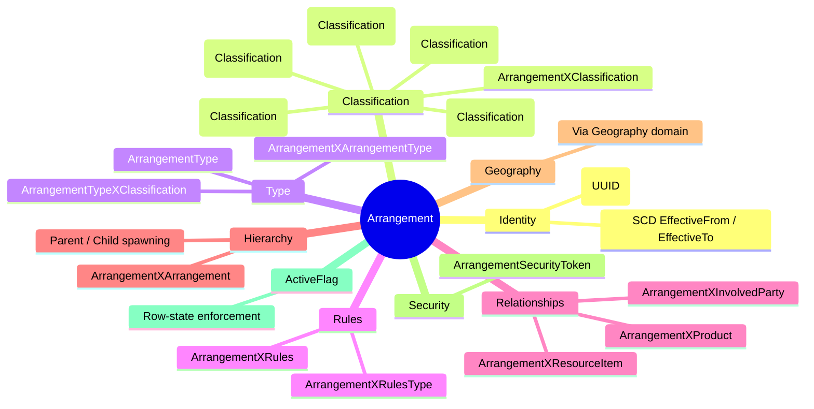
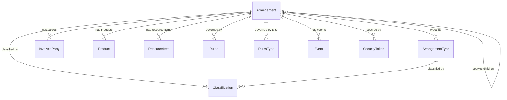
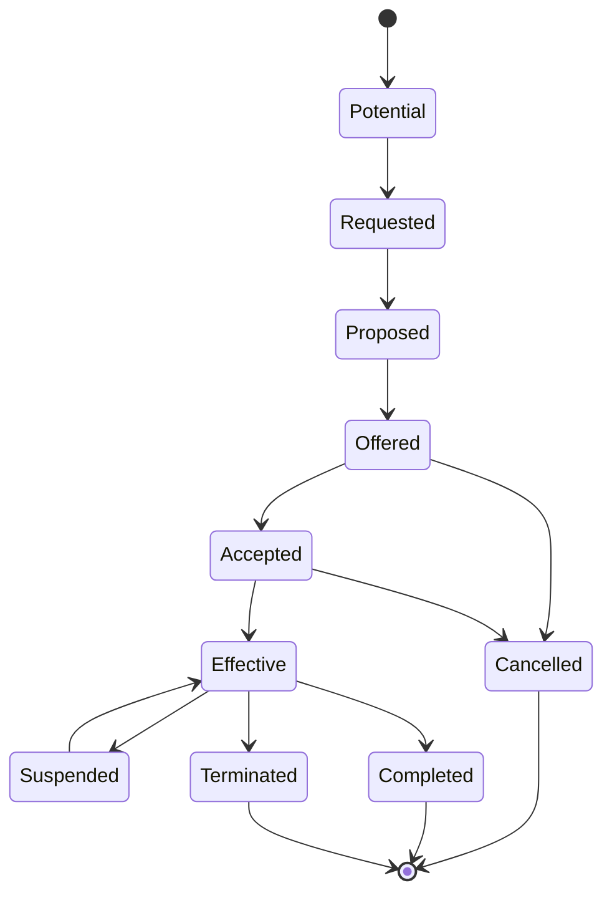
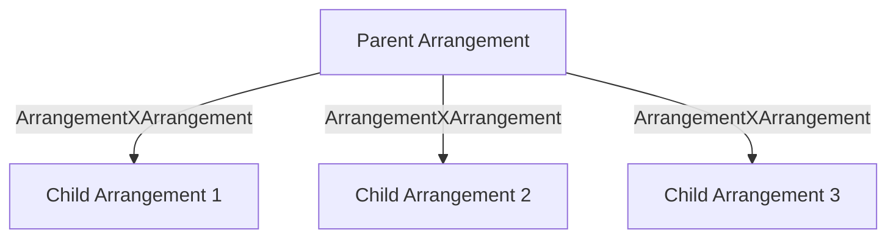

# 🤝 Arrangements

> **An Arrangement is the formal memory of an agreement — proposed, offered, accepted, active, suspended, completed, cancelled, or terminated — between Involved Parties, with the rules, obligations, products, classifications, and statuses that make the agreement meaningful.**

Arrangements are one of the big anchor domains in **ActivityMaster Core**. They sit in the intersection between **Involved Party**, **Product**, **Resource Item**, **Rules**, **Classification**, and **Event**.

In plain human terms: an Arrangement is where the model says, _"Something has been agreed, or may be agreed, and we need to know who, what, why, under what rules, and in what state."_

---

## ✨ Why Arrangements Matter

The Arrangement domain gives ActivityMaster a canonical way to describe agreements without locking the model into one narrow business product shape.

An Arrangement can represent things like:

- 🏦 a loan agreement
- 💳 an overdraft protection agreement
- 📄 an employment contract
- 🧾 a purchase agreement
- 🏠 a lease or property settlement
- 🧰 a service agreement
- 🛡️ a guarantee or collateral arrangement
- 📦 a product-originated agreement
- 🔐 a confidentiality or authority agreement

The important bit is that the model does not treat these as random special cases. It treats them as **Arrangements** with classification, lifecycle, identity, related parties, related products, related rules, hierarchy, and security token enforcement.

That is the FSDM magic: make the model broad enough to survive enterprise reality, but structured enough that we can still reason about it cleanly. 🧩

---

## 🧠 The Arrangement Mental Model

An Arrangement is not just the agreement row. It is the **hub** around which the agreement is described.

| Concern | What it answers | Implementation |
|---|---|---|
| 🧾 Identity | "Which agreement is this?" | `Arrangement.ArrangementID` (UUID, SCD-tracked) |
| 🧭 Type | "What kind of agreement is this?" | `ArrangementType` via `ArrangementXArrangementType` |
| 🛠️ Customization | "Is this standard or tailored?" | Classification via `ArrangementXClassification` |
| 🧑‍🤝‍🧑 Parties | "Who participates?" | `ArrangementXInvolvedParty` |
| 📦 Product | "Which product is involved?" | `ArrangementXProduct` |
| 🧱 Resource Item | "Does it govern resource usage, sale, or exchange?" | `ArrangementXResourceItem` |
| 📍 Geography | "Where is it valid, agreed, delivered, or governed?" | Via the Geography domain |
| 🎯 Purpose | "Why does this arrangement exist?" | Classification via `ArrangementXClassification` |
| 💬 Reason | "What motivated entering it?" | Classification via `ArrangementXClassification` |
| ⚖️ Rules | "What rules govern it?" | `ArrangementXRules` / `ArrangementXRulesType` |
| 🔄 Lifecycle | "Where is it in its journey?" | Classification via `ArrangementXClassification` |
| 💰 Financial State | "Is it financially in order?" | Classification via `ArrangementXClassification` |
| 🔗 Hierarchy | "Does this arrangement spawn child arrangements?" | `ArrangementXArrangement` (parent/child) |
| 🔐 Security | "Who has access?" | `ArrangementSecurityToken` |

---

## 🏛️ Core Definition

| Item | Value |
|---|---|
| **Schema** | `Arrangement` |
| **Table** | `Arrangement` |
| **Java class** | `com.guicedee.activitymaster.fsdm.db.entities.arrangement.Arrangement` |
| **Interface** | `IArrangement<J, Q>` |
| **Primary key** | `ArrangementID` (UUID) |
| **Extends** | `WarehouseSCDTable` (SCD temporal tracking, ActiveFlag, System, Enterprise) |

An **Arrangement** represents an agreement, either potential or actual, involving two or more **Involved Parties**. It provides and affirms the rules and obligations associated with the sale, exchange, or provision of goods and services.

### Inherited columns (from WarehouseSCDTable)

All Arrangement domain entities inherit standard warehouse columns:

| Column | Source | Purpose |
|---|---|---|
| `EffectiveFromDate` | `WarehouseCoreTable` (SCD) | Temporal validity start |
| `EffectiveToDate` | `WarehouseCoreTable` (SCD) | Temporal validity end |
| `ActiveFlagID` | `WarehouseSCDTable` | Row-state lifecycle enforcement |
| `SystemID` | `WarehouseSCDTable` | Owning system reference |
| `EnterpriseID` | `WarehouseTable` | Enterprise tenant |
| `OriginalSourceSystemID` | `WarehouseTable` | Source system origin |
| `OriginalSourceSystemUniqueID` | `WarehouseTable` | Source system unique key |

---

## 🧭 Arrangement Domain Map

---

## 🔄 Lifecycle: The Arrangement Journey

Arrangement lifecycle is tracked through **Classifications** attached via `ArrangementXClassification`. At any single point in time, an Arrangement should have one current lifecycle classification, while the SCD pattern preserves historical lifecycle movement.

| Lifecycle state | Meaning |
|---|---|
| 🌱 **Potential** | Not yet in existence, but likely enough to track. |
| 🙋 **Requested** | Solicited by an Involved Party. |
| 🧪 **Proposed** | Conditions discussed, but no binding offer yet. |
| 📬 **Offered** | Binding offer submitted. |
| ✅ **Accepted** | Agreement officially accepted. |
| 🟢 **Effective** | Currently active and operating under its terms. |
| ⏸️ **Suspended** | Temporarily on hold. |
| 🚫 **Cancelled** | Never became effective. |
| 🛑 **Terminated** | Ended prematurely with obligations not fully discharged. |
| 🏁 **Completed** | Obligations fully discharged. |

These lifecycle states are stored as **Classification** values and linked to the Arrangement through `ArrangementXClassification`.

---

## 🔗 Hierarchy: Arrangements That Spawn Arrangements

The `ArrangementXArrangement` table defines parent–child relationships between Arrangements. This models real-world scenarios where one agreement spawns sub-agreements:

- A master service agreement spawns individual work orders
- A framework loan agreement spawns individual drawdown arrangements
- A franchise agreement spawns location-specific operating arrangements

| Column | Type | Purpose |
|---|---|---|
| `ArrangementXArrangementID` | UUID | Primary key |
| `ParentArrangementID` | FK → `Arrangement` | The spawning arrangement |
| `ChildArrangementID` | FK → `Arrangement` | The spawned arrangement |
| `ClassificationID` | FK → `Classification` | Classifies the relationship |
| `Value` | String | Classification value describing the relationship |

The hierarchy supports the `IContainsHierarchy` interface for `addChild`, `findParent`, `findChildren`, and `archiveChild` operations.

---

## 🧩 Entity Catalogue

### `Arrangement` — The Agreement Hub

**Schema:** `Arrangement` · **Table:** `Arrangement` · **PK:** `ArrangementID` (UUID)

The main entity. All relationship and classification entities radiate from here.

| Column | Type | Notes |
|---|---|---|
| `ArrangementID` | UUID | Primary key |
| + inherited SCD, ActiveFlag, System, Enterprise columns | | See WarehouseSCDTable |

**Collections:**

| Field | Target entity | Relationship |
|---|---|---|
| `classifications` | `ArrangementXClassification` | Purpose, Reason, Customization, Lifecycle, Financial Status — all via Classification |
| `types` | `ArrangementXArrangementType` | Arrangement Type links |
| `parties` | `ArrangementXInvolvedParty` | Involved Party participation |
| `products` | `ArrangementXProduct` | Product relationships |
| `resources` | `ArrangementXResourceItem` | Resource Item relationships |
| `rules` | `ArrangementXRules` | Rules governing the arrangement |
| `ruleTypes` | `ArrangementXRulesType` | Rule Type relationships |
| `arrangementXArrangementList` | `ArrangementXArrangement` | Children (this as parent) |
| `arrangementXArrangementList1` | `ArrangementXArrangement` | Parents (this as child) |
| `events` | `EventXArrangement` | Event relationships |
| `securities` | `ArrangementSecurityToken` | Security token enforcement |

---

### `ArrangementType` — Arrangement Type

**Schema:** `Arrangement` · **Table:** `ArrangementType` · **PK:** `ArrangementTypeID` (UUID)

Classifies the Arrangement based on its nature or use. Named and described, with its own classification bridge.

| Column | Type | Notes |
|---|---|---|
| `ArrangementTypeID` | UUID | Primary key |
| `ArrangementTypeName` | `VARCHAR(150)` | Human-readable type name |
| `ArrangementTypeDescription` | `VARCHAR(500)` | Detailed description |
| + inherited SCD, ActiveFlag, System, Enterprise columns | | |

**Collections:**

| Field | Target entity |
|---|---|
| `classifications` | `ArrangementTypeXClassification` |
| `arrangementsList` | `ArrangementXArrangementType` |
| `securities` | `ArrangementTypeSecurityToken` |

#### Arrangement Type Values

| Type | Meaning |
|---|---|
| 🏢 **Organization Arrangement** | Defines how an Organization is legally organized (partnership, incorporation, charter). |
| 👔 **Employment Arrangement** | Defines employment between an Involved Party and an Organization. |
| 🪪 **Authority Arrangement** | Gives one party power to act for another (e.g. Power of Attorney). |
| 🤝 **Cooperation Arrangement** | Defines cooperation for a project or manner of work. |
| 🔐 **Confidentiality Arrangement** | Non-disclosure or restricted disclosure obligations. |
| 🎁 **Benefit Arrangement** | Special advantage to another party (e.g. discounted rate). |
| 🧾 **Membership Arrangement** | Membership under organizational rules. |
| 🛠️ **Service Arrangement** | Services provided by one party to another. |
| 🛡️ **Guarantee Arrangement** | Financial responsibility accepted by a third party. |
| 🏘️ **Leasing Arrangement** | Use of equipment or property for a specified period. |
| 📦 **Merchandise Sale** | Sale of goods or equipment for consideration. |
| 🏠 **Property Settlement** | Transfer of legal title for buildings, vehicles, or land. |
| 🔒 **Collateral Arrangement** | Resource Item pledged as security for an obligation. |
| ™️ **Licensing Agreement** | Rights or privileges to use tangible or intangible resources. |
| 🔁 **Lending Arrangement** | Limited use of Resource Items (e.g. securities lending). |

---

### `ArrangementXClassification` — Classification Bridge

**Schema:** `Arrangement` · **Table:** `ArrangementXClassification` · **PK:** `ArrangementXClassificationID` (UUID)

The generic bridge between an Arrangement and Classifications. This single table carries what the original FSDM modelled as separate Purpose, Reason, Customization, Lifecycle Status, and Financial Status entities. The Classification value determines the meaning.

| Column | Type | Notes |
|---|---|---|
| `ArrangementXClassificationID` | UUID | Primary key |
| `ArrangementID` | FK → `Arrangement` | The classified arrangement |
| `ClassificationID` | FK → `Classification` | The classification value |
| `Value` | String | Classification value (inherited from relationship table) |
| + inherited SCD columns | | |

**What lives here:**

| FSDM concept | How it's stored |
|---|---|
| Arrangement Purpose | Classification with purpose-type value |
| Arrangement Reason | Classification with reason-type value |
| Arrangement Customization (Standard / Tailored) | Classification with customization-type value |
| Arrangement Lifecycle Status | Classification with lifecycle-type value |
| Arrangement Financial Status | Classification with financial-status value |
| Any other classification | Classification with appropriate value |

---

### `ArrangementXArrangementType` — Type Link

**Schema:** `Arrangement` · **Table:** `ArrangementXArrangementType` · **PK:** `ArrangementXArrangementTypeID` (UUID)

Links an Arrangement to one or more ArrangementTypes, with a Classification and value describing the link.

| Column | Type | Notes |
|---|---|---|
| `ArrangementXArrangementTypeID` | UUID | Primary key |
| `ArrangementID` | FK → `Arrangement` | The arrangement |
| `ArrangementTypeID` | FK → `ArrangementType` | The type |
| `ClassificationID` | FK → `Classification` | Classification of the link |
| `Value` | String | Link value |

---

### `ArrangementXInvolvedParty` — Party Participation

**Schema:** `Arrangement` · **Table:** `ArrangementXInvolvedParty` · **PK:** `ArrangementXInvolvedPartyID` (UUID)

Links an Arrangement to Involved Parties. The same party can participate multiple times with different classifications (roles).

| Column | Type | Notes |
|---|---|---|
| `ArrangementXInvolvedPartyID` | UUID | Primary key |
| `ArrangementID` | FK → `Arrangement` | The arrangement |
| `InvolvedPartyID` | FK → `InvolvedParty` | The participating party |
| `ClassificationID` | FK → `Classification` | Role classification |
| `Value` | String | Role value |

---

### `ArrangementXProduct` — Product Relationship

**Schema:** `Arrangement` · **Table:** `ArrangementXProduct` · **PK:** `ArrangementXProductID` (UUID)

Links an Arrangement to Products.

| Column | Type | Notes |
|---|---|---|
| `ArrangementXProductID` | UUID | Primary key |
| `ArrangementID` | FK → `Arrangement` | The arrangement |
| `ProductID` | FK → `Product` | The product |
| `ClassificationID` | FK → `Classification` | Relationship classification |
| `Value` | String | Relationship value |

---

### `ArrangementXResourceItem` — Resource Item Relationship

**Schema:** `Arrangement` · **Table:** `ArrangementXResourceItem` · **PK:** `ArrangementXResourceItemID` (UUID)

Links an Arrangement to Resource Items (sale, lease, licensing, collateral, lending).

| Column | Type | Notes |
|---|---|---|
| `ArrangementXResourceItemID` | UUID | Primary key |
| `ArrangementID` | FK → `Arrangement` | The arrangement |
| `ResourceItemID` | FK → `ResourceItem` | The resource item |
| `ClassificationID` | FK → `Classification` | Relationship classification |
| `Value` | String | Relationship value |

---

### `ArrangementXRules` — Rules Governance

**Schema:** `Arrangement` · **Table:** `ArrangementXRules` · **PK:** `ArrangementXRulesID` (UUID)

Links an Arrangement to the Rules that govern it. This replaces the FSDM Condition concept.

| Column | Type | Notes |
|---|---|---|
| `ArrangementXRulesID` | UUID | Primary key |
| `ArrangementID` | FK → `Arrangement` | The arrangement |
| `RulesID` | FK → `Rules` | The governing rule |
| `ClassificationID` | FK → `Classification` | Rule classification |
| `Value` | String | Rule value |

---

### `ArrangementXRulesType` — Rule Type Governance

**Schema:** `Arrangement` · **Table:** `ArrangementXRulesType` · **PK:** `ArrangementXRulesTypeID` (UUID)

Links an Arrangement to Rule Types.

| Column | Type | Notes |
|---|---|---|
| `ArrangementXRulesTypeID` | UUID | Primary key |
| `ArrangementID` | FK → `Arrangement` | The arrangement |
| `RulesTypeID` | FK → `RulesType` | The rule type |
| `ClassificationID` | FK → `Classification` | Classification of the link |
| `Value` | String | Link value |

---

### `ArrangementXArrangement` — Hierarchy (Parent–Child)

**Schema:** `Arrangement` · **Table:** `ArrangementXArrangement` · **PK:** `ArrangementXArrangementID` (UUID)

Defines the parent–child hierarchy between Arrangements. Models arrangements that spawn arrangements.

| Column | Type | Notes |
|---|---|---|
| `ArrangementXArrangementID` | UUID | Primary key |
| `ParentArrangementID` | FK → `Arrangement` | The spawning (parent) arrangement |
| `ChildArrangementID` | FK → `Arrangement` | The spawned (child) arrangement |
| `ClassificationID` | FK → `Classification` | Relationship classification |
| `Value` | String | Hierarchy value |

---

### `ArrangementTypeXClassification` — Type Classification Bridge

**Schema:** `Arrangement` · **Table:** `ArrangementTypeXClassification` · **PK:** `ArrangementTypeXClassificationID` (UUID)

Links ArrangementTypes to Classifications for further type categorization.

| Column | Type | Notes |
|---|---|---|
| `ArrangementTypeXClassificationID` | UUID | Primary key |
| `ArrangementTypeID` | FK → `ArrangementType` | The type being classified |
| `ClassificationID` | FK → `Classification` | The classification value |

---

### Security Token Tables

Every entity in the Arrangement schema has a paired SecurityToken table that enforces row-level access control via `SecurityToken` metadata.

| Security Token Table | Secures |
|---|---|
| `ArrangementSecurityToken` | `Arrangement` |
| `ArrangementTypeSecurityToken` | `ArrangementType` |
| `ArrangementXClassificationSecurityToken` | `ArrangementXClassification` |
| `ArrangementXArrangementSecurityToken` | `ArrangementXArrangement` |
| `ArrangementXArrangementTypeSecurityToken` | `ArrangementXArrangementType` |
| `ArrangementXInvolvedPartySecurityToken` | `ArrangementXInvolvedParty` |
| `ArrangementXProductSecurityToken` | `ArrangementXProduct` |
| `ArrangementXResourceItemSecurityToken` | `ArrangementXResourceItem` |
| `ArrangementXRulesSecurityToken` | `ArrangementXRules` |
| `ArrangementXRulesTypeSecurityToken` | `ArrangementXRulesType` |
| `ArrangementTypeXClassificationSecurityToken` | `ArrangementTypeXClassification` |

Each SecurityToken table follows the `WarehouseSecurityTable` pattern with a foreign key back to the secured entity's primary key.

---

## 🗂️ Full Entity Index

| Table | Schema | Java Class | Purpose |
|---|---|---|---|
| `Arrangement` | `Arrangement` | `Arrangement` | Core agreement entity |
| `ArrangementType` | `Arrangement` | `ArrangementType` | Named and described agreement type |
| `ArrangementXClassification` | `Arrangement` | `ArrangementXClassification` | Classification bridge (purpose, reason, customization, lifecycle, financial status) |
| `ArrangementXArrangementType` | `Arrangement` | `ArrangementXArrangementType` | Links Arrangement to ArrangementType |
| `ArrangementXArrangement` | `Arrangement` | `ArrangementXArrangement` | Parent–child hierarchy (arrangements spawning arrangements) |
| `ArrangementXInvolvedParty` | `Arrangement` | `ArrangementXInvolvedParty` | Links Arrangement to InvolvedParty |
| `ArrangementXProduct` | `Arrangement` | `ArrangementXProduct` | Links Arrangement to Product |
| `ArrangementXResourceItem` | `Arrangement` | `ArrangementXResourceItem` | Links Arrangement to ResourceItem |
| `ArrangementXRules` | `Arrangement` | `ArrangementXRules` | Links Arrangement to Rules |
| `ArrangementXRulesType` | `Arrangement` | `ArrangementXRulesType` | Links Arrangement to RulesType |
| `ArrangementTypeXClassification` | `Arrangement` | `ArrangementTypeXClassification` | Links ArrangementType to Classification |
| `ArrangementSecurityToken` | `Arrangement` | `ArrangementSecurityToken` | Security for Arrangement |
| `ArrangementTypeSecurityToken` | `Arrangement` | `ArrangementTypeSecurityToken` | Security for ArrangementType |
| `ArrangementXClassificationSecurityToken` | `Arrangement` | `ArrangementXClassificationSecurityToken` | Security for ArrangementXClassification |
| `ArrangementXArrangementSecurityToken` | `Arrangement` | `ArrangementXArrangementSecurityToken` | Security for ArrangementXArrangement |
| `ArrangementXArrangementTypeSecurityToken` | `Arrangement` | `ArrangementXArrangementTypeSecurityToken` | Security for ArrangementXArrangementType |
| `ArrangementXInvolvedPartySecurityToken` | `Arrangement` | `ArrangementXInvolvedPartySecurityToken` | Security for ArrangementXInvolvedParty |
| `ArrangementXProductSecurityToken` | `Arrangement` | `ArrangementXProductSecurityToken` | Security for ArrangementXProduct |
| `ArrangementXResourceItemSecurityToken` | `Arrangement` | `ArrangementXResourceItemSecurityToken` | Security for ArrangementXResourceItem |
| `ArrangementXRulesSecurityToken` | `Arrangement` | `ArrangementXRulesSecurityToken` | Security for ArrangementXRules |
| `ArrangementXRulesTypeSecurityToken` | `Arrangement` | `ArrangementXRulesTypeSecurityToken` | Security for ArrangementXRulesType |
| `ArrangementTypeXClassificationSecurityToken` | `Arrangement` | `ArrangementTypeXClassificationSecurityToken` | Security for ArrangementTypeXClassification |
| `ArrangementHierarchyView` | `Arrangement` | `ArrangementsHierarchyView` | Read-only hierarchy view |

---

## 🧬 Implementation Notes for ActivityMaster

### 1. Keep Arrangement as the hub

Do not flatten everything into Arrangement. The surrounding relationship and classification entities are not noise; they are the model's ability to preserve context.

A clean implementation keeps the hub small:

- `ArrangementID`
- inherited SCD, ActiveFlag, System, Enterprise columns
- relationship collections

The meaning lives in the typed relationships and classifications.

### 2. Classification is the universal vocabulary

Purpose, Reason, Customization, Lifecycle Status, and Financial Status all flow through `ArrangementXClassification`. The **Classification** value determines the semantic meaning. This is more flexible than separate entity tables for each concept while still preserving the FSDM intent.

### 3. SCD preserves historical shape

The `WarehouseSCDTable` base class provides `EffectiveFromDate` and `EffectiveToDate` on every entity. This replaces the need for separate historical identity, name, or status tracking entities from the original FSDM.

### 4. Let Rules do the rule work

Arrangement should not become a bucket of bespoke rule fields. The `ArrangementXRules` and `ArrangementXRulesType` bridges let reusable Rules govern many kinds of Arrangements.

That keeps the Arrangement model stable while allowing business rules to evolve.

### 5. Keep Party role separate from Party

The model links Arrangement to **InvolvedParty** through `ArrangementXInvolvedParty` with a Classification describing the role. The same party can play more than one role in the same Arrangement through multiple link rows with different classifications.

Example:

- Bank A classified as Investment Manager
- Bank A classified as Custodian

Same Involved Party, different responsibilities. Tiny detail, huge modelling win. 🧠

### 6. Geography is a separate domain

Location relationships are handled through the **Geography** domain rather than a dedicated arrangement-location bridge table. This keeps geographic concerns consolidated.

### 7. Hierarchy models spawning

The `ArrangementXArrangement` parent–child table models arrangements that create child arrangements. This is not just grouping — it captures the spawning relationship with its own classification context.

### 8. Every entity is security-aware

Every table in the Arrangement schema has a paired `SecurityToken` table. This enforces row-level access control through `SecurityToken` metadata propagation.

---

## 🧭 Suggested Website Summary

For a shorter card or landing page summary:

> **Arrangements model the agreements at the heart of ActivityMaster.** They connect Involved Parties, Products, Resource Items, Rules, and Classifications into one canonical agreement view. An Arrangement may be potential, active, suspended, completed, cancelled, or terminated — with the full historical trail preserved through SCD tracking and Classification-based lifecycle management. Arrangements can spawn child arrangements through the hierarchy, and every entity is secured via SecurityToken enforcement.

---

## 🪴 Friendly Developer Reading

When you are new to this part of the model, read it in this order:

1. 🏛️ Start with `Arrangement` — the agreement hub.
2. 🧭 Understand `ArrangementType` and `ArrangementXArrangementType` — the type system.
3. 📋 Read `ArrangementXClassification` — how purpose, reason, customization, lifecycle, and financial status all flow through Classification.
4. ⚖️ Read `ArrangementXRules` — the rules and obligations.
5. 🧑‍🤝‍🧑 Read `ArrangementXInvolvedParty` — who is involved.
6. 📦 Read `ArrangementXProduct` and `ArrangementXResourceItem` — what the agreement concerns.
7. 🔗 Read `ArrangementXArrangement` — how arrangements spawn arrangements.
8. 🔐 Read the SecurityToken tables — how access is enforced.

---
