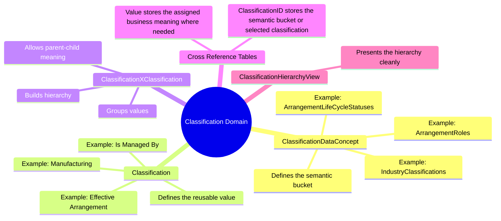
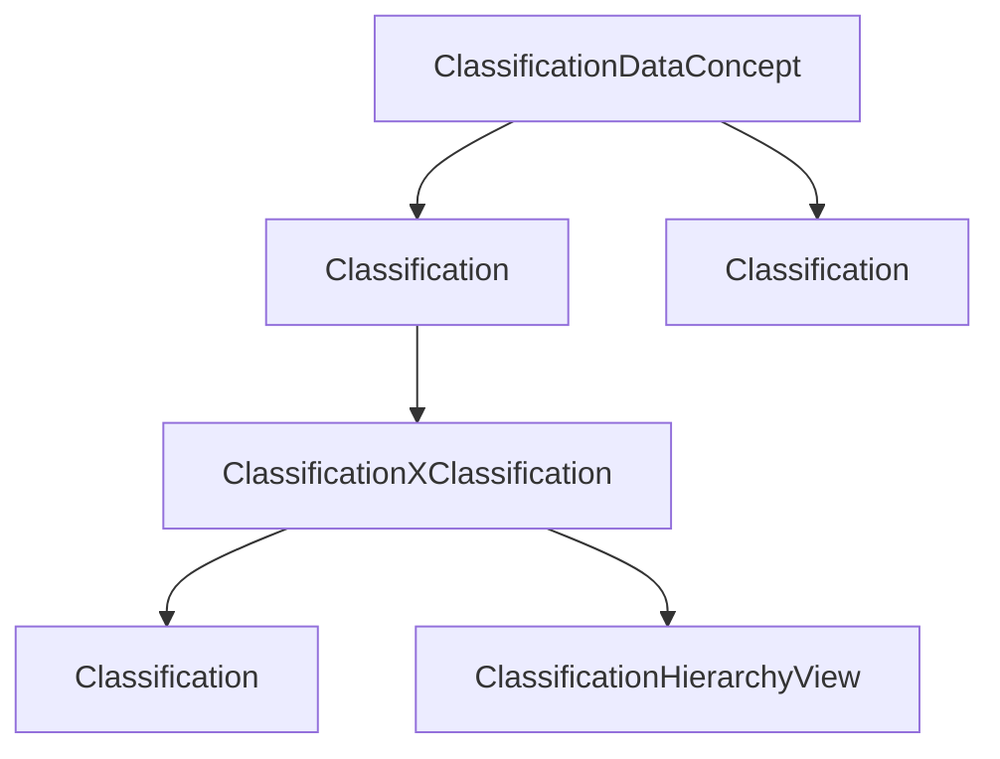
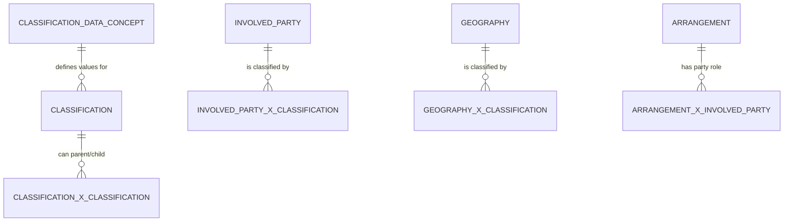

# 🧩 Classifications & Data Concepts

> **Classifications are the shared vocabulary of ActivityMaster. A ClassificationDataConcept defines the question, bucket, or scheme; a Classification provides one of the valid business answers inside that concept.**

The Classification domain is where ActivityMaster keeps reusable business meaning without forcing every domain to create a tiny table for every possible status, role, purpose, type, reason, descriptor, or relationship label.

In plain human terms:

> _ClassificationDataConcept says what kind of meaning we are talking about._  
> _Classification says the specific meaning we selected._

That gives the model its little bit of FSDM magic ✨ — enough structure to reason cleanly, enough flexibility to avoid going absolutely wild with normalization.

---

## ✨ Why Classifications Matter

The FSDM Classification concept exists because enterprise data is full of reusable business categories:

- 🧑‍🤝‍🧑 party types, roles, relationships, and descriptors
- 🤝 arrangement lifecycle states, reasons, purposes, financial statuses, and relationship meanings
- 📦 product categories, product purposes, and product relationship labels
- 🌍 geography and address types
- 🧾 event types, event reasons, and event relationship meanings
- 🧰 resource item natures, ownership meanings, data classifications, and document types
- 🔐 security token types, access categories, and row-level grouping semantics

Instead of modelling every one of those as a new physical entity, ActivityMaster stores many of them as **Classifications** under a named **ClassificationDataConcept**.

This is the main simplification:

```text
Many old tiny lookup/type tables
        ↓
ClassificationDataConcept + Classification
        ↓
Reusable concepts, values, hierarchy, and cross-domain links
```

---

## 🧠 Mental Model



---

## 🧱 ActivityMaster Implementation Shape

| Concern | ActivityMaster entity / column | Purpose |
|---|---|---|
| 🧩 Concept bucket | `ClassificationDataConcept` | Defines the reusable business question, scheme, or semantic grouping. |
| 🏷️ Classification value | `Classification` | Stores the actual reusable classification value. |
| 🌳 Classification hierarchy | `ClassificationXClassification` | Relates classifications to other classifications for parent-child or grouping structures. |
| 🔗 Concept-to-classification link | `ClassificationDataConceptXClassification` | Explicitly links concepts to classification values where the implementation needs a cross-reference. |
| 📎 Concept-to-resource link | `ClassificationDataConceptXResourceItem` | Allows supporting documentation or resource items to be attached to a concept. |
| 📦 Classification-to-resource link | `ClassificationXResourceItem` | Allows supporting documentation or resource items to be attached to a classification value. |
| 👀 Hierarchy read model | `ClassificationHierarchyView` | Provides the readable classification hierarchy. |
| 🔐 Row-level security | `{Entity}SecurityToken` | Applies ActivityMaster security to classification records and relationships. |

---

## 🧾 Core Entities

### 🧩 `ClassificationDataConcept`

A **ClassificationDataConcept** is the named container for a classification scheme.

It answers:

> “What kind of classification are we dealing with?”

Examples:

| ClassificationDataConcept | Meaning |
|---|---|
| `ArrangementRoles` | Role assigned to an Involved Party in an Arrangement. |
| `ArrangementLifeCycleStatuses` | Lifecycle state of an Arrangement. |
| `ArrangementLifeCycleStatusReasons` | Reason for an Arrangement lifecycle change. |
| `ArrangementFinancialStatuses` | Financial standing of an Arrangement. |
| `ArrangementPurposes` | Intended reason for an Arrangement. |
| `ArrangementReasons` | Motive for entering an Arrangement. |
| `IndustryClassifications` | Business industry categories reusable across domains. |
| `MarketSegments` | Segment definitions and grouping categories. |
| `AccountingUnits` | Accounting-oriented categories used to track values across domains. |
| `AddressTypes` | Physical or logical address categories. |
| `GeographyTypes` | Geographic area categories. |

The naming should remain friendly, stable, and implementation-safe. Prefer plural concept names where the concept naturally represents a set of possible values.

### 🏷️ `Classification`

A **Classification** is a value inside a concept.

It answers:

> “Which business meaning applies?”

Examples:

| Concept | Classification values |
|---|---|
| `ArrangementRoles` | `Is Managed By`, `Is Advised By`, `Is Guaranteed By`, `Has Witness` |
| `ArrangementLifeCycleStatuses` | `Potential Arrangement`, `Offered Arrangement`, `Accepted Arrangement`, `Effective Arrangement`, `Completed Arrangement` |
| `ArrangementFinancialStatuses` | `In Order Arrangement`, `Out Of Order Arrangement`, `Approved Out Of Order Arrangement`, `In Default Arrangement` |
| `IndustryClassifications` | `Agricultural`, `Manufacturing`, `Light Industrial`, `Services` |
| `MarketSegments` | `High Income Metropolitan Individuals`, `Selected Product Users`, `Dormant Customers` |
| `AccountingUnits` | `Loan Interest Tracking`, `Employee Count Tracking`, `ATM Count Tracking` |

---

## 🧬 Column Model

### `Classification`

| Column / field | Purpose |
|---|---|
| `ClassificationID` / `id` | Primary UUID identifier for the classification. |
| `ClassificationName` | Short display name of the classification value. |
| `ClassificationDesc` | Human-readable explanation of the classification value. |
| `ClassificationSequenceNumber` | Sort order within the concept. |
| `ClassificationDataConceptID` / `concept` | The concept this classification belongs to. |
| `EffectiveFromDate` | When the classification becomes effective. |
| `EffectiveToDate` | When the classification expires. |
| `ActiveFlagID` | Active / deleted / archived state. |
| `SystemID` | Owning system. |
| `EnterpriseID` | Owning enterprise. |

### `ClassificationDataConcept`

`ClassificationDataConcept` follows the standard ActivityMaster warehouse columns and acts as the stable concept anchor for classification values.

Recommended semantic fields:

| Column / field | Purpose |
|---|---|
| `ClassificationDataConceptID` / `id` | Primary UUID identifier for the concept. |
| Concept name | Stable, code-safe name such as `ArrangementRoles` or `IndustryClassifications`. |
| Concept description | Friendly explanation of the question, scheme, or bucket. |
| Standard warehouse columns | Effective dates, enterprise, system, source tracking, active flag, timestamps. |

> 🧭 Implementation note: if the concrete entity already has different field names for concept name/description, use the existing Java/database names. The important semantic rule is that `ClassificationDataConcept` is the bucket and `Classification` is the selectable value.

---

## 🔗 How Classifications Are Used Across ActivityMaster

Classifications appear in two major ways.

### 1. Direct classification of an entity

Some entities carry a classification directly when the classification is intrinsic to the entity.

Examples:

| Entity | Classification use |
|---|---|
| `Address` | `ClassificationID` identifies the address type. |
| `Geography` | `ClassificationID` identifies the geography type. |
| `SecurityToken` | `SecurityTokenClassificationID` identifies the token type. |
| `Classification` | `ClassificationDataConceptID` identifies the concept the value belongs to. |

### 2. Classification through a relationship table

Most domain semantics are captured through cross-reference tables.

In those tables:

- `ClassificationID` identifies the semantic bucket or selected classification, depending on the concrete table design.
- `Value` stores the assigned business meaning, measurement, role, reason, label, or relationship value.
- the two FK columns identify the linked business objects.

Example:

| Semantic need | ActivityMaster representation |
|---|---|
| An Involved Party has a role in an Arrangement | `ArrangementXInvolvedParty` + `ClassificationID = ArrangementRoles` + `Value = Is Managed By` |
| An Arrangement has a lifecycle status | `ArrangementXClassification` + `ClassificationID = ArrangementLifeCycleStatuses` + `Value = Effective Arrangement` |
| A Product is related to a Product package | `ProductXProduct` + relationship classification/value pattern |
| A Resource Item has a document classification | `ResourceItemXClassification` + concept/value pattern |
| A Geography is grouped by an industry classification | `GeographyXClassification` + `ClassificationID = IndustryClassifications` + `Value = Manufacturing` |

---

## 🌳 Hierarchies

Classification hierarchies allow ActivityMaster to group, structure, and browse business meaning.



Useful hierarchy shapes include:

| Hierarchy style | Meaning | Example |
|---|---|---|
| 🧱 Main hierarchy | Groups/classes of things. | Involved Party → Organization → Manufacturer. |
| 🪪 Descriptor hierarchy | Attributive information. | Involved Party → Marital Status → Unmarried. |
| 🔗 Relationship hierarchy | How things relate to each other. | Involved Party → Is Customer Of → Organization. |

ActivityMaster does not need three separate physical hierarchies for every concept. The preferred implementation is to use **ClassificationDataConcept**, **Classification**, and **ClassificationXClassification** to express the hierarchy cleanly, then expose the readable shape through **ClassificationHierarchyView**.

---

## 🧭 Classification as Cross-Domain Language

The Classification data concept is special because it can classify both:

1. **individual records** in other domains, and
2. **groups of business information** that span several domains.

### 🧑‍🤝‍🧑 Classifying individual records

Example: Involved Parties can be classified by common characteristics.

| Business meaning | ActivityMaster representation |
|---|---|
| An Involved Party is an organization | `InvolvedPartyXClassification` + classification value `Organization` |
| An Involved Party is an individual | `InvolvedPartyXClassification` + classification value `Individual` |
| An organization is a manufacturer | `InvolvedPartyXClassification` + classification value `Manufacturer` |
| An individual is an accountant | `InvolvedPartyXClassification` + classification value `Accountant` |
| An individual is unmarried | `InvolvedPartyXClassification` + classification value `Unmarried` |

### 🌍 Reusing one classification structure across domains

Example: industry classification can apply to both organizations and geographic areas.

| Business meaning | ActivityMaster representation |
|---|---|
| Organization operates in manufacturing | `InvolvedPartyXClassification` + `ClassificationID = IndustryClassifications` + `Value = Manufacturing` |
| Geographic area is predominantly agricultural | `GeographyXClassification` + `ClassificationID = IndustryClassifications` + `Value = Agricultural` |
| Geographic area is predominantly service-oriented | `GeographyXClassification` + `ClassificationID = IndustryClassifications` + `Value = Services` |

This is one of the useful simplifications: the meaning is reusable, but each domain keeps its own relationship table.

---

## 📊 Segments and Accounting Units

Some classifications describe **groups of business information**, not just one record.

### 🎯 Segments

A Segment is a reusable business grouping, often defined by criteria.

Example:

> All Involved Parties who are individuals, unmarried, earn more than R50,000 per year, and live in large metropolitan areas in the South West region of South Africa.

In ActivityMaster, this should be represented as a classification concept and values, with the detailed rules expressed through related `Rules`, `RulesType`, or supporting `ResourceItem` documentation where the segmentation logic becomes too rich for a simple value.

| Concern | Suggested ActivityMaster representation |
|---|---|
| Segment category | `ClassificationDataConcept = MarketSegments` |
| Segment value | `Classification = High Income Metropolitan Unmarried Individuals` |
| Segment criteria | `Rules` / `RulesType` linked to the classification or concept where needed. |
| Segment documentation | `ClassificationXResourceItem` or `ClassificationDataConceptXResourceItem`. |

### 🧮 Accounting Units

Accounting Units are classification-style structures used to track values of other data concepts.

Examples:

- interest portion of a loan arrangement
- number of full-time and part-time employees
- number of automated teller machines operated by the financial institution

Suggested ActivityMaster representation:

| Concern | Suggested ActivityMaster representation |
|---|---|
| Accounting unit category | `ClassificationDataConcept = AccountingUnits` |
| Accounting unit value | `Classification = Loan Interest Tracking`, `Employee Count Tracking`, `ATM Count Tracking` |
| Tracked subject | Link through the relevant domain XRef, such as `ArrangementXClassification`, `InvolvedPartyXClassification`, or `ResourceItemXClassification`. |
| Numeric value | Store in the relevant relationship `Value` field, or in a purpose-built measurement/event table if time-series accounting values are required. |

> ⚠️ Needs confirmation: if Accounting Units become financial measures rather than classification labels, they may need an additional fact/value structure rather than only `Classification` and `Value`.

---

## 🧩 ClassificationDataConcept Naming Guide

Use names that are:

- stable in code;
- plural when the concept contains selectable values;
- domain-aware when the concept belongs mainly to one domain;
- reusable when the concept is genuinely cross-domain.

| Good concept name | Why it works |
|---|---|
| `ArrangementRoles` | Domain-specific and clear. |
| `ArrangementLifeCycleStatuses` | Clear lifecycle bucket for Arrangement state. |
| `IndustryClassifications` | Reusable across Involved Party and Geography. |
| `MarketSegments` | Cross-domain business grouping. |
| `AccountingUnits` | Cross-domain accounting grouping. |
| `AddressTypes` | Domain-specific but reusable within Address. |
| `ResourceItemNatures` | Clear classification of Resource Item meaning. |

Avoid names that are:

- tied to legacy abbreviations;
- named after old tables;
- too generic to be useful, such as `Types` or `Statuses`;
- too normalized into one-table-per-value-set unless there is a strong implementation reason.

---

## ✅ What Is Handled

| Capability | Current ActivityMaster support |
|---|---|
| Core classification values | Handled by `Classification`. |
| Concept buckets / schemes | Handled by `ClassificationDataConcept`. |
| Classification hierarchy | Handled by `ClassificationXClassification` and `ClassificationHierarchyView`. |
| Classifying other entities | Handled by domain XRef tables such as `ArrangementXClassification`, `ProductXClassification`, `ResourceItemXClassification`, and others. |
| Reusable classification across domains | Handled by reusing the same `ClassificationDataConcept` and `Classification` values through different domain XRefs. |
| Attached documentation | Handled by `ClassificationXResourceItem` and `ClassificationDataConceptXResourceItem`. |
| SCD history | Handled through standard effective date and warehouse timestamp columns. |
| Security | Handled through `{Entity}SecurityToken` pattern. |

---

## 🧹 What Is Simplified

| Legacy-style concern | ActivityMaster simplification |
|---|---|
| Separate type tables for every domain concept | Use `ClassificationDataConcept` + `Classification`. |
| Separate relationship type tables | Use the relevant domain XRef table with `ClassificationID` and `Value`. |
| Separate descriptor/type structures | Use concepts, classifications, hierarchy, and relationship values. |
| Cross-domain classification duplication | Reuse the same classification concept and value from multiple domain XRefs. |
| Deep normalization for every category | Keep the classification model flexible and only add dedicated entities when the category has real behaviour or lifecycle beyond classification. |

---

## ⚠️ Missing or Needs Confirmation

| Area | Current position | Decision needed |
|---|---|---|
| `ClassificationDataConcept` visible columns | The concept entity exists, but the public documentation should confirm its exact name/description fields. | Confirm concrete Java/database fields for concept display name and description. |
| Segment rules | Segments are semantically classification groups, but criteria can become rule-heavy. | Confirm whether segment criteria belong in `Rules`, `RulesType`, resource documentation, or a future criteria/fact model. |
| Accounting units | Accounting Units can be classification labels, but tracked amounts/counts may be measures. | Confirm whether simple `Value` is enough or whether ActivityMaster needs a measurement/value table. |
| Main / descriptor / relationship hierarchy labels | ActivityMaster can represent hierarchy generically. | Confirm whether these hierarchy styles should be explicit classifications or only documentation language. |
| Classification governance | Classifications can be reused widely. | Confirm ownership rules, naming conventions, and whether concept names are globally unique per enterprise. |
| Ordering and display | `ClassificationSequenceNumber` exists. | Confirm whether ordering is per concept only, or per parent-child hierarchy as well. |
| Classification versioning | SCD columns preserve history. | Confirm how renamed classifications should behave: expire/create new vs update in place. |

---

## 🧪 Implementation Checks Before Code Generation

Before generating migrations, seed data, service methods, or website data pages, confirm:

- `ClassificationDataConcept` has stable name and description columns available in the implementation.
- `ClassificationName`, `ClassificationDesc`, and `ClassificationSequenceNumber` are populated for all values.
- Concept names are unique within the expected enterprise/system scope.
- Reusable concepts such as `IndustryClassifications` are not duplicated per domain.
- Domain-specific concepts such as `ArrangementRoles` remain domain-specific where the business meaning is not reusable elsewhere.
- `ClassificationXClassification` can express the required parent-child hierarchy cleanly.
- `ClassificationHierarchyView` exposes enough information for website navigation.
- `Value` on relationship tables is used only where the relationship needs an assigned value, label, measure, or qualifier.
- Rich criteria, formulas, or business rules are linked through `Rules` rather than squeezed into a plain classification value.

---

## 🗺️ Suggested Seed Concepts

These are good starter concepts for the current ActivityMaster model.

| Concept | Example values | Notes |
|---|---|---|
| `ArrangementRoles` | `Is Managed By`, `Is Advised By`, `Is Guaranteed By`, `Has Witness` | Used with `ArrangementXInvolvedParty`. |
| `ArrangementLifeCycleStatuses` | `Potential Arrangement`, `Offered Arrangement`, `Accepted Arrangement`, `Effective Arrangement`, `Completed Arrangement` | Used with `ArrangementXClassification`. |
| `ArrangementFinancialStatuses` | `In Order Arrangement`, `Out Of Order Arrangement`, `In Default Arrangement` | Used with `ArrangementXClassification`. |
| `IndustryClassifications` | `Agricultural`, `Manufacturing`, `Light Industrial`, `Services` | Reusable across Involved Party and Geography. |
| `MarketSegments` | `High Income Metropolitan Individuals`, `Product Activity Segment` | Segment criteria may link to Rules. |
| `AccountingUnits` | `Loan Interest Tracking`, `Employee Count Tracking`, `ATM Count Tracking` | May need future measurement support. |
| `AddressTypes` | `Residential Address`, `Mailing Address`, `Telephone Number`, `SWIFT Number` | Used by `Address`. |
| `GeographyTypes` | `Country`, `State`, `City`, `Statistical Area` | Used by `Geography`. |
| `ResourceItemNatures` | `Collateral`, `Documentation Item`, `Equipment`, `Intangible Asset` | Used by Resource Item relationships and classifications. |
| `EventTypes` | `Communication`, `Accounting Transaction`, `Maintenance Transaction`, `Posting Entry` | Used by `EventType` and event classifications. |

---

## 🧭 Practical Rule of Thumb

Use a dedicated entity when the thing has its own behaviour, lifecycle, identity, or operational process.

Use Classification when the thing is mainly:

- a category;
- a status;
- a role;
- a reason;
- a purpose;
- a descriptor;
- a reusable business answer;
- a relationship meaning;
- a grouping used across more than one domain.

That keeps ActivityMaster close to FSDM without making the implementation feel like it needs a thousand tiny lookup tables. 🧱

---

## 🧾 Tiny Example

A customer is in a market segment, has an industry classification, and participates in an arrangement.



| Row | Meaning |
|---|---|
| `ClassificationDataConcept = IndustryClassifications` | The semantic bucket for industry. |
| `Classification = Manufacturing` | A reusable industry value. |
| `InvolvedPartyXClassification` | Links an organization to `Manufacturing`. |
| `GeographyXClassification` | Links a geographic area to `Manufacturing` if the region is predominantly manufacturing. |
| `ArrangementXInvolvedParty` | Links an Involved Party to an Arrangement, with `ClassificationID = ArrangementRoles` and `Value = Is Managed By`. |

---

## 🌱 Final Shape

The Classification domain should remain the model’s shared vocabulary layer:

- `ClassificationDataConcept` defines the question.
- `Classification` defines the answer.
- `ClassificationXClassification` defines hierarchy.
- Domain XRef tables apply the meaning to real business records.
- `Value` carries assigned relationship meaning where the relationship needs more than just the two linked IDs.

This gives ActivityMaster a clean way to preserve FSDM meaning while keeping the implementation calm, practical, and website-friendly.
