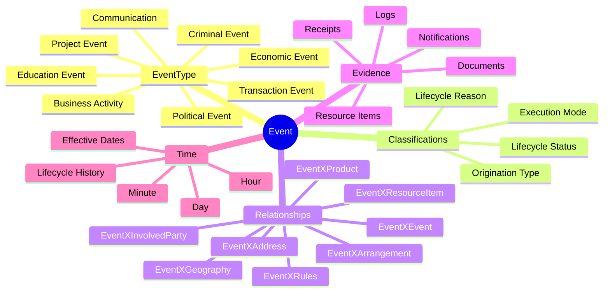
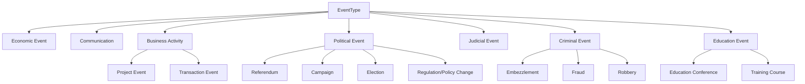

# 🧾 Events

> **An Event is an activity, happening, communication, transaction, maintenance action, operational occurrence, or external occurrence that ActivityMaster needs to record because it matters to the financial institution.**

Events are the activity trail of the model. They capture **what happened**, **when it happened**, **who or what was involved**, **what it affected**, and **which business meaning should be attached to that occurrence**.

In plain human terms:

> _Event records the thing that happened._  
> _EventType describes what kind of thing happened._  
> _Event relationships connect the thing that happened to parties, arrangements, products, resources, addresses, geography, and rules._

This makes Events one of the most important audit, activity, workflow, and history concepts in ActivityMaster. 🧭

---

## ✨ Why Events Matter

Financial institutions do not only store static master data. They also need to know what happened around that data:

- 💬 a customer requested an interim statement;
- 💸 a transfer, deposit, payment, or posting was performed;
- 📝 a maintenance entry changed customer, arrangement, product, rule, or location data;
- 📣 a product was advertised or affected by a market event;
- 📄 a document, receipt, notification, or file recorded an event;
- 🧑‍⚖️ an event was authorised, requested, audited, or performed by a party;
- 🌍 an event occurred in, originated from, or sent something to a place;
- 🔁 one event triggered, resulted from, corrected, reversed, or sequenced another event;
- ⚠️ an external event such as a robbery, fire, election, regulation change, or market collapse affected the institution.

ActivityMaster keeps this manageable by using a small Event core plus reusable relationship tables and classification values.

```text
Many old event-specific relationship/type tables
        ↓
Event + EventType + EventX... relationships
        ↓
ClassificationID = semantic bucket
Value            = assigned relationship meaning / status / reason
        ↓
Rich event semantics without table explosion
```

---

## 🧠 Mental Model



---

## 🧱 ActivityMaster Implementation Shape

| Concern | ActivityMaster entity / relationship | Purpose |
|---|---|---|
| 🧾 Event anchor | `Event` | Canonical record of the activity or occurrence. |
| 🏷️ Event type | `EventType` + `EventXEventType` | Classifies the inherent kind of event. |
| 🧩 Flexible event classifications | `EventXClassification` | Captures lifecycle, execution mode, origination type, reasons, and other event descriptors. |
| 🤝 Event to arrangement | `EventXArrangement` | Links events to arrangements they maintain, create, result from, or otherwise affect. |
| 🧑 Event to party | `EventXInvolvedParty` | Links events to requesting, authorising, affected, auditing, or performing parties. |
| 📦 Event to product | `EventXProduct` | Links events to products they maintain, advertise, or affect. |
| 🧰 Event to resource item | `EventXResourceItem` | Links events to documents, evidence, assets, receipts, equipment, or other resources. |
| 📜 Event to rules | `EventXRules` | Links events to rules, conditions, limits, controls, policies, or maintained rule definitions. |
| 🏠 Event to address | `EventXAddress` | Links events to physical or logical address points. |
| 🌍 Event to geography | `EventXGeography` | Links events to countries, regions, jurisdictions, or other geographic areas. |
| 🔁 Event to event | `EventXEvent` | Links related events, sequences, reversals, triggers, corrections, or grouped event chains. |
| 🌳 Event hierarchy | Event relationship views / `EventXEvent` | Supports event chains, grouped events, and activity lineage. |
| 🔐 Security | `{Entity}SecurityToken` | Applies row-level access to event records and event relationship rows. |

---

## 🧬 Core Entity Usage

### 🧾 `Event`

`Event` is the canonical occurrence record.

It should be used whenever ActivityMaster needs to record that something happened, was attempted, was planned, was processed, was changed, was communicated, or was observed.

Typical examples:

| Example | Meaning |
|---|---|
| Announcement of a pending corporate stock split | An external event that may affect products, arrangements, investments, or resource items. |
| Request to change a beneficiary name on a trust account | A communication / maintenance event involving an arrangement, party, and supporting rules. |
| Transfer of funds | A transaction event involving parties, products, arrangements, resources, and accounting effects. |
| Deposit of a cheque | A transaction event documented by a receipt or cheque image. |
| Product maintenance entry | An event that changes the name, terms, or setup of a product. |
| Fire, robbery, election, or regulation change | External events the institution may not control but may still need to record. |

### 🏷️ `EventType`

`EventType` captures the inherent kind of event. For the major event taxonomy, prefer `EventType` + `EventXEventType` rather than creating a dedicated table per event type.

Examples:

```text
EventXEventType
  EventID     = the event
  EventTypeID = Communication / Transaction Event / Economic Event / etc.
  Value       = optional qualifier where needed
```

### 🧩 `EventXClassification`

Use `EventXClassification` for reusable event descriptors that are not structural enough to deserve their own entity.

Examples:

| Semantic need | ActivityMaster representation |
|---|---|
| Event execution mode | `EventXClassification` + `ClassificationID = EventExecutionModes` + `Value = Automated Execution Event` |
| Event origination | `EventXClassification` + `ClassificationID = EventOriginationTypes` + `Value = Externally Initiated` |
| Event lifecycle status | `EventXClassification` + `ClassificationID = EventLifeCycleStatuses` + `Value = Completed Event` |
| Event lifecycle reason | `EventXClassification` + `ClassificationID = EventLifeCycleStatusReasons` + `Value = Missing Required Information` |

---

## ⏱️ Time and Lifecycle

Events have two useful ideas of time:

1. **The event occurrence / processing time**, represented in ActivityMaster by event time fields such as `dayID`, `hourID`, and `minuteID`.
2. **The lifecycle history**, represented through inherited SCD dates and event lifecycle classifications.

ActivityMaster entities inherit temporal columns such as `effectiveFromDate`, `effectiveToDate`, `warehouseCreatedTimestamp`, and `warehouseLastUpdatedTimestamp`. Event-specific timing is then supported by `dayID`, `hourID`, and `minuteID`.

> 🧭 Implementation note: use lifecycle classifications for the state of an event, and use the Event time fields for the time bucket of the event itself. If a subtype-specific “as-of” or “actual transmission” date is needed later, model it deliberately rather than hiding it in free text.

---

## 🏷️ Event Types

Event types classify what kind of event occurred.

| Event type | Meaning | Examples |
|---|---|---|
| `Economic Event` | An event with economic implications or economic context. | Currency devaluation; collapse of a stock exchange. |
| `Communication` | An event whose purpose is to exchange information with an InvolvedParty. | Receive a customer's request for an interim statement; transmit a liquidity report to a reserve authority. |
| `Business Activity` | An action performed by or for the financial institution while fulfilling its business purpose. | Operational work, maintenance work, service fulfilment. |
| `Project Event` | A business activity with defined start dates, end dates, resources, and goals. | A project to develop and implement new financial offerings. |
| `Transaction Event` | Business work that changes the institution's financial position or information base. | Posting debits or credits; maintenance entries; audit-trail business activity. |
| `Referendum` | A political event where a population votes on a proposed law or issue. | Public vote on a proposed law. |
| `Campaign` | A political event involving competition for public office. | Political campaign activity. |
| `Election` | A political event where people are selected for office by vote. | National, regional, or local election. |
| `Regulation/Policy Change` | A political or authority-driven change to rules, standards, or guidelines. | Regulation change affecting lending or reporting. |
| `Judicial Event` | An event related to administration of justice by a legal authority. | Court action or legal authority action affecting business operations. |
| `Embezzlement` | A criminal event involving fraudulent taking of funds in violation of trust. | Misappropriation of entrusted funds. |
| `Fraud` | A criminal event involving unfair or dishonest advantage through deceit or breach of confidence. | Forgery; counterfeit money usage. |
| `Robbery` | A criminal event involving the taking of another's property. | Theft of items from a house or institution. |
| `Education Conference` | An education event where people meet to consult or discuss a subject for training purposes. | Finance industry conference; banking association conference. |
| `Training Course` | An event where knowledge of a topic is taught to attendees. | Project management training; self-study credit rating course. |

> 🌳 Hierarchy note: `Business Activity` can group `Project Event` and `Transaction Event`. Political, criminal, education, and economic event groupings can be represented through event type hierarchy or classification hierarchy depending on the final implementation preference.

---

## ⚙️ Execution Modes

Execution mode describes how the event was executed.

| Value | Meaning | Examples |
|---|---|---|
| `Automated Execution Event` | Execution proceeds with little or no human intervention. | Automatic notification sent to a branch manager for large transactions; ATM-initiated transaction; automated interest posting. |
| `Manual Execution Event` | Execution requires significant human intervention or participation. | Manual delivery of employee paychecks; transaction initiated by presenting a cheque document. |

Recommended representation:

```text
EventXClassification
  ClassificationID = EventExecutionModes
  Value            = Automated Execution Event / Manual Execution Event
```

---

## 🧭 Origination Types

Origination type describes whether the event was initiated from inside or outside the institution.

| Value | Meaning | Examples |
|---|---|---|
| `Internally Initiated` | The event execution is initiated from within the financial institution. | Internal memo communicating benefits changes. |
| `Externally Initiated` | The event execution is initiated by a party, event, or trigger outside the financial institution. | Newswire story received by the institution; external trigger about a charity promotional event. |

Recommended representation:

```text
EventXClassification
  ClassificationID = EventOriginationTypes
  Value            = Internally Initiated / Externally Initiated
```

---

## 🔄 Lifecycle Statuses

Lifecycle status describes where the event is in its execution or processing journey.

| Value | Meaning | Examples |
|---|---|---|
| `Pending Event` | The event is not instantly released for processing but is or can be released at an appointed future time. | Scheduled processing waiting for a future date. |
| `In Progress Event` | The event is currently being carried out. | A transaction, request, or workflow step currently processing. |
| `Suspended Event` | Event execution has been temporarily interrupted. | Processing paused because a dependency is unavailable. |
| `Cancelled Event` | The event was terminated before completion. | Application or process cancelled before fulfilment. |
| `Completed Event` | Event execution ended and fulfilled the intended activity. | Order, transaction, communication, or maintenance action completed. |
| `Abandoned Event` | The event was acted upon but did not accomplish its intended effect. | Failed credit entry that could not be posted because the account was closed. |

Recommended representation:

```text
EventXClassification
  ClassificationID = EventLifeCycleStatuses
  Value            = Completed Event
```

> 📝 Spelling note: the legacy material used `Abondoned Event`. ActivityMaster should use the corrected value `Abandoned Event`, with legacy import aliases handled in seed/migration logic if needed.

---

## 🧾 Lifecycle Status Reasons

Lifecycle status reasons explain why an event is or was in a lifecycle state.

| Value | Meaning | Examples |
|---|---|---|
| `Account Closed` | An existing account or accounting unit is no longer open. | Transaction cannot proceed because the target account is closed. |
| `Financial Institution Error` | Incorrect processing by the institution. | Entry amount incorrect or applied to the wrong account. |
| `Customer Request` | A customer directive has been received. | Customer requests cancellation or processing change. |
| `Dishonored Document` | Required funds could not be collected. | Deposited cheques returned unpaid. |
| `Exceeded Retry Limit` | Processing was submitted more times than allowed. | Automated retry limit exceeded. |
| `Failed Trade` | An order to buy or sell securities, financial instruments, or commodities was not executed. | Failed securities trade. |
| `Funds Temporarily Unavailable` | Funds are temporarily unavailable. | Temporary liquidity or availability issue. |
| `Insufficient Funds` | Account balance was not sufficient to meet a request for funds. | Payment or withdrawal cannot be completed. |
| `Missing Required Information` | Required input is missing. | Application or event is pending because supporting information is incomplete. |
| `No Answer Back` | An attempt to access a system or contact a person failed. | No response from system or person. |
| `Omission` | Expected action did not happen or information was missing. | Customer deposit event never presented because the deposit was lost. |
| `Stop Payment` | A request to withhold payment has been received. | Stop-payment instruction on a cheque. |
| `Stale Check` | Time between cheque issue and presentation exceeded the allowed period. | Cheque presented too late under applicable rules. |
| `System Down` | One or more system components failed to work. | Processing platform unavailable. |
| `System Busy` | A temporary delay caused by high activity on a processing system. | Processing delayed due to system load. |
| `Waiting For As Of Date` | Processing is delayed until a specified future time is reached. | Pending event waiting for an effective/as-of date. |

Recommended representation:

```text
EventXClassification
  ClassificationID = EventLifeCycleStatusReasons
  Value            = Missing Required Information
```

> ⚠️ Gap note: the current simplified model can capture the status and the reason as event classifications. If the business must tie a reason to one exact lifecycle-status occurrence, the implementation should either align dates/correlation values carefully or add a more explicit lifecycle-status detail structure later.

---

## 🔗 Relationship and Value Pattern

Event relationship tables carry two important things:

```text
EventXSomething
  EventID          = the event
  SomethingID      = the linked thing
  ClassificationID = the semantic bucket / relationship concept
  Value            = the assigned business meaning
```

Examples:

| Semantic need | ActivityMaster representation |
|---|---|
| Event maintains an arrangement | `EventXArrangement` + `ClassificationID = EventArrangementRelationships` + `Value = Maintains` |
| Arrangement results from an event | `EventXArrangement` + `ClassificationID = EventArrangementRelationships` + `Value = Results From` |
| Event is controlled by a rule | `EventXRules` + `ClassificationID = EventRulesRelationships` + `Value = Is Controlled By` |
| Event applies to a party | `EventXInvolvedParty` + `ClassificationID = EventInvolvedPartyRelationships` + `Value = Applies To` |
| Event affects a product | `EventXProduct` + `ClassificationID = EventProductRelationships` + `Value = Affects` |
| Event is documented by a resource item | `EventXResourceItem` + `ClassificationID = EventResourceItemRelationships` + `Value = Is Documented By` |
| Event occurs at an address or in a geography | `EventXAddress` / `EventXGeography` + `ClassificationID = EventLocationRelationships` + `Value = Occurs In` |

---

## 🤝 Event ↔ Arrangement

Use `EventXArrangement` to link an event to an arrangement.

| Value | Meaning | Examples |
|---|---|---|
| `Maintains` | The event creates, changes, deletes, or otherwise modifies an arrangement. | A maintenance entry maintains a consumer credit agreement. |
| `Results From` | The arrangement ensues from the occurrence of an event. | A loan arrangement results from a sales call. |

Recommended representation:

```text
EventXArrangement
  EventID          = the event
  ArrangementID    = the arrangement
  ClassificationID = EventArrangementRelationships
  Value            = Maintains / Results From
```

---

## 📜 Event ↔ Rules

Use `EventXRules` for business rules, limits, controls, and legacy condition-style semantics.

| Value | Meaning | Examples |
|---|---|---|
| `Is Controlled By` | The event fulfils, is subject to, or is governed by a particular rule or condition. | Promotional event controlled by a maximum investment amount. |
| `Maintains` | The event creates, changes, deletes, or otherwise modifies a rule or condition. | Maintenance entry maintains the limit on the number of charitable events sponsored per year. |

Recommended representation:

```text
EventXRules
  EventID          = the event
  RulesID          = the rule / condition / policy / control
  ClassificationID = EventRulesRelationships
  Value            = Is Controlled By / Maintains
```

> 🧩 Simplification note: the source semantics describe Conditions. ActivityMaster currently carries this through `Rules` and `EventXRules`, which is consistent with the simplified canonical shape. If a dedicated Condition entity is reintroduced later, this section should be revisited.

---

## 🧑‍🤝‍🧑 Event ↔ InvolvedParty

Use `EventXInvolvedParty` to show how a party participates in, authorises, requests, audits, performs, or is affected by an event.

| Value | Meaning | Examples |
|---|---|---|
| `Applies To` | The event applies to a particular party. | A change-of-address event applies to customer John Doe. |
| `Is Authorized By` | The event is authorised by a particular party. | A transfer is authorised by J. Doe. |
| `Is Requested By` | The event is requested by a particular party. | A transfer of R500 is requested by Company A. |
| `Maintains` | The event maintains or changes party-related information. | A maintenance event updates party information. |
| `Is Audited By` | The event is audited by a particular party. | An audit review is performed by an internal auditor. |

Recommended representation:

```text
EventXInvolvedParty
  EventID          = the event
  InvolvedPartyID  = the party
  ClassificationID = EventInvolvedPartyRelationships
  Value            = Is Authorized By / Is Requested By / Applies To / etc.
```

> 🪪 Reference note: event-party references such as merchant reference numbers, customer reference numbers, transaction references, or authorisation references can be carried through `Value` only when the relationship meaning itself is the reference. If the reference must be separately queryable, a dedicated implementation field or resource-item link should be considered.

---

## 🏠🌍 Event ↔ Address / Geography

The older FSDM material used a broad location idea. ActivityMaster separates this into `Address` and `Geography`.

Use:

- `EventXAddress` when the event relates to a street address, contact point, delivery address, mailbox, telephone number, or logical address;
- `EventXGeography` when the event relates to a country, region, jurisdiction, market area, city, district, or other geographic area.

| Value | Meaning | Examples |
|---|---|---|
| `Occurs In` | The event is planned for or took place in a location. | Fire occurred in a building; civil war occurred in a country; concert occurs in a city. |
| `Originates From` | The event is initiated from a specific location. | Promotion originates from the Southeast Region; funds transfer originates from Albuquerque. |
| `Maintains` | The event creates, modifies, deletes, or otherwise maintains a location/address/geography value. | Maintenance entry maintains the house number of an address. |
| `Sends To` | The event causes something to be transported or transmitted to a location. | Funds transfer sends funds to Frankfurt, Germany. |

Recommended representation:

```text
EventXAddress / EventXGeography
  EventID          = the event
  AddressID        = address or logical address, when address-like
  GeographyID      = geographic area, when geography-like
  ClassificationID = EventLocationRelationships
  Value            = Occurs In / Originates From / Maintains / Sends To
```

---

## 📦 Event ↔ Product

Use `EventXProduct` to link events to products that they maintain, advertise, or affect.

| Value | Meaning | Examples |
|---|---|---|
| `Maintains` | The event creates, modifies, deletes, or otherwise maintains a product. | Maintenance entry maintains the name of a product. |
| `Advertises` | The event makes information available to the public about a product or service. | Commercial promotional message advertises the product being promoted. |
| `Affects` | The event has consequences that require product change or attention. | Regulation change affects a consumer loan product; explosion affects an insurance product; invention affects an equipment merchandise product. |

Recommended representation:

```text
EventXProduct
  EventID          = the event
  ProductID        = the product
  ClassificationID = EventProductRelationships
  Value            = Maintains / Advertises / Affects
```

---

## 🧰 Event ↔ ResourceItem

Use `EventXResourceItem` for documents, receipts, evidence, assets, devices, equipment, records, publications, and other resource items connected to an event.

| Value | Meaning | Examples |
|---|---|---|
| `Permits Operation Of` | The event enables operation or functioning of a resource item. | Granting a residential use permit permits operation of a single-family dwelling. |
| `Disrupts Operation Of` | The event interrupts or disturbs operation of a resource item. | Fire disrupts operation of a piece of equipment. |
| `Causes Loss Of` | The event results in the institution being unable to locate a resource item. | Robbery causes loss of electronic delivery equipment. |
| `Maintains` | The event creates, changes, deletes, or modifies a resource item. | Maintenance entry maintains the name of a specific commercial paper. |
| `Causes Acquisition Of` | The event brings about control or ownership of a resource item. | Purchase causes acquisition of a twelve-floor office building. |
| `Is Documented By` | The event is described or recorded by a resource item. | Customer deposit documented by a receipt; competitor promotion documented by a media release. |

Recommended representation:

```text
EventXResourceItem
  EventID          = the event
  ResourceItemID   = the document / asset / evidence / resource
  ClassificationID = EventResourceItemRelationships
  Value            = Is Documented By / Maintains / Causes Acquisition Of / etc.
```

---

## 🔁 Event ↔ Event

Use `EventXEvent` to link one event to another event.

Typical uses:

| Relationship idea | Meaning | Examples |
|---|---|---|
| Trigger / result | One event causes or leads to another event. | A communication event triggers a transaction event. |
| Sequence | Events happen in a defined order. | Trade lifecycle events or security issue action declarations. |
| Posting detail | One event groups the posting entries related to a transaction. | A transaction event links to debit and credit posting events. |
| Correction / reversal | One event corrects, reverses, cancels, or supersedes another. | Reversal event linked to original failed or incorrect event. |
| Grouping | Several related events belong together. | A campaign event groups communications, product advertisements, and responses. |

Recommended representation:

```text
EventXEvent
  EventID          = the parent / source event
  RelatedEventID   = the child / related event
  ClassificationID = EventEventRelationships
  Value            = Triggered / Resulted In / Corrects / Reverses / Groups / etc.
```

> ⚠️ Gap note: the uploaded Event material explains why events relate to other events, but it does not provide a full controlled value set for event-to-event relationship meanings. The examples above should be treated as proposed seed candidates until confirmed.

---

## 📝 Event Comments and Notes

The source material includes free-form event comments for operational notes, temporary notepads, and running logs.

Examples:

| Example | Meaning |
|---|---|
| Customer's cheques 123 through 146 have been stolen | Operational note against a stop-payment event. |
| J. Doe investigating | Running investigation note. |
| Cheques found | Follow-up note or update. |

ActivityMaster currently has no explicit `EventComment` entity in the entity catalogue.

Recommended options:

| Option | Fit | Notes |
|---|---|---|
| `EventXResourceItem` + `Value = Is Documented By` | Best for durable notes, evidence, attachments, documents, and logs. | Treat note/log content as a `ResourceItem` or `ResourceItemData`. |
| `EventXClassification` + `ClassificationID = EventComments` + `Value = ...` | Lightweight but less ideal. | Useful only for short comments that do not need document semantics. |
| Add an explicit comment/log entity later | Best if comments become operationally important. | Keep this as a gap until usage patterns are clearer. |

> 🧭 Practical recommendation: use `ResourceItem` for comments/logs that matter, because comments often become evidence.

---

## 🧩 Suggested ClassificationDataConcept Seeds

These concepts provide the semantic buckets used by event relationships and classifications.

| ClassificationDataConcept | Used by | Example values |
|---|---|---|
| `EventExecutionModes` | `EventXClassification` | `Automated Execution Event`, `Manual Execution Event` |
| `EventOriginationTypes` | `EventXClassification` | `Internally Initiated`, `Externally Initiated` |
| `EventLifeCycleStatuses` | `EventXClassification` | `Pending Event`, `Completed Event`, `Cancelled Event` |
| `EventLifeCycleStatusReasons` | `EventXClassification` | `Missing Required Information`, `Insufficient Funds`, `System Down` |
| `EventArrangementRelationships` | `EventXArrangement` | `Maintains`, `Results From` |
| `EventRulesRelationships` | `EventXRules` | `Is Controlled By`, `Maintains` |
| `EventInvolvedPartyRelationships` | `EventXInvolvedParty` | `Applies To`, `Is Authorized By`, `Is Requested By` |
| `EventLocationRelationships` | `EventXAddress`, `EventXGeography` | `Occurs In`, `Originates From`, `Maintains`, `Sends To` |
| `EventProductRelationships` | `EventXProduct` | `Maintains`, `Advertises`, `Affects` |
| `EventResourceItemRelationships` | `EventXResourceItem` | `Is Documented By`, `Causes Acquisition Of`, `Causes Loss Of` |
| `EventEventRelationships` | `EventXEvent` | `Triggered`, `Resulted In`, `Corrects`, `Reverses`, `Groups` |
| `EventComments` | `EventXClassification` or `EventXResourceItem` | Short note / document note concepts, if needed. |

---

## 🌳 Suggested Event Type Hierarchy



> 🧩 Implementation note: if `EventType` supports hierarchy directly, this can be implemented as event type hierarchy. If not, the hierarchy can be represented through `ClassificationXClassification` and linked to event types via seed logic or controlled mappings.

---

## ✅ What Is Handled

| FSDM need | ActivityMaster handling | Status |
|---|---|---|
| Record an event/activity | `Event` | ✅ Handled |
| Classify the inherent kind of event | `EventType` + `EventXEventType` | ✅ Handled |
| Capture event execution mode | `EventXClassification` + `ClassificationID = EventExecutionModes` | ✅ Handled |
| Capture internal/external origination | `EventXClassification` + `ClassificationID = EventOriginationTypes` | ✅ Handled |
| Track lifecycle status | `EventXClassification` + `ClassificationID = EventLifeCycleStatuses` | ✅ Handled |
| Track lifecycle status reason | `EventXClassification` + `ClassificationID = EventLifeCycleStatusReasons` | ✅ Handled, with correlation caveat |
| Link event to arrangements | `EventXArrangement` | ✅ Handled |
| Link event to parties | `EventXInvolvedParty` | ✅ Handled |
| Link event to products | `EventXProduct` | ✅ Handled |
| Link event to resources / documents | `EventXResourceItem` | ✅ Handled |
| Link event to rules / conditions | `EventXRules` | ✅ Handled as Rules |
| Link event to address-like locations | `EventXAddress` | ✅ Handled |
| Link event to geographic locations | `EventXGeography` | ✅ Handled |
| Link event to other events | `EventXEvent` | ✅ Handled |
| Apply temporal history | SCD columns + event time fields | ✅ Handled |
| Apply row-level security | `{Entity}SecurityToken` | ✅ Handled |

---

## 🧩 What Is Simplified

| Source-style concept | ActivityMaster simplification | Why |
|---|---|---|
| Separate event relationship type tables | Relationship entity + `ClassificationID` + `Value` | Avoids one tiny table per relationship meaning. |
| Separate event lifecycle status table | `EventXClassification` with lifecycle status concept | Keeps lifecycle values flexible and temporal. |
| Separate lifecycle reason table | `EventXClassification` with lifecycle reason concept | Works unless exact status-to-reason row binding is required. |
| Broad location relationship | Split into `EventXAddress` and `EventXGeography` | Better matches ActivityMaster's Address and Geography domains. |
| Condition relationship | `EventXRules` | ActivityMaster models rule/condition semantics through Rules. |
| Event comment table | Prefer `EventXResourceItem` or confirm dedicated note strategy | Avoids adding a table before comment semantics are clear. |
| Many event category lookup tables | `EventType`, `Classification`, and hierarchy | Preserves meaning without table explosion. |

---

## ⚠️ Missing or Needs Confirmation

| Area | Why it matters | Suggested decision |
|---|---|---|
| Event comments / running logs | Operational notes can become evidence or audit history. | Prefer `ResourceItem` / `ResourceItemData`; add dedicated comments only if needed. |
| Exact lifecycle status-to-reason binding | A reason may need to explain one specific status occurrence. | Use matching effective dates/correlation first; add detail entity only if required. |
| Event-to-event relationship values | Entity exists, but the uploaded event material does not provide a full controlled value set. | Confirm values such as `Triggered`, `Resulted In`, `Corrects`, `Reverses`, `Groups`, `Sequences`. |
| Event-party reference numbers | Some events have party-specific references, such as merchant/customer/authorisation references. | Decide whether `Value` is enough or whether a dedicated reference model is required. |
| Event subtype-specific dates | Examples mention actual transmittal date/time and as-of date/time. | Keep core event time simple; add subtype fields only when real use cases require them. |
| EventType hierarchy implementation | Event type taxonomy is hierarchical. | Confirm whether hierarchy lives in `EventType`, `ClassificationXClassification`, or a view. |
| Rules vs dedicated condition model | Current model uses `Rules`; FSDM semantics sometimes say condition. | Keep `Rules` unless a separate Condition concept is reintroduced. |

---

## 🔐 Security and Sensitivity

Events can contain sensitive operational, financial, legal, criminal, customer, employee, and audit information.

Security should be applied to:

- the `Event` row;
- event-party relationship rows;
- event-resource/document relationship rows;
- event comments and evidence;
- event rules and controls;
- event lifecycle statuses and failure reasons;
- criminal, judicial, political, or regulatory event classifications where access must be restricted.

> 🔐 Practical rule: treat events as audit-sensitive by default. If an event says what happened, who did it, who authorised it, and why it failed, it is probably security-relevant.

---

## 🧪 Implementation Checks Before Code Generation

Before generating or changing code for Events, confirm:

- `EventType` supports the required event taxonomy and, if needed, hierarchy.
- `EventXClassification` can carry lifecycle, origination, execution mode, and reason concepts.
- Relationship tables expose `ClassificationID` and `Value` consistently.
- `EventXRules` is the accepted implementation for rule/condition semantics.
- `EventXAddress` and `EventXGeography` cover all legacy location meanings.
- `EventXResourceItem` is accepted for documents, receipts, media releases, comments, logs, and evidence.
- Event comments do not require a dedicated first-class table yet.
- Event-to-event value seeds are agreed before loading hierarchy or workflow chains.
- SCD and `dayID` / `hourID` / `minuteID` are enough for the current event timing requirements.

---

## 🧭 Practical Modelling Examples

### Customer requests a beneficiary change

```text
Event
  EventType = Communication

EventXInvolvedParty
  ClassificationID = EventInvolvedPartyRelationships
  Value            = Is Requested By

EventXArrangement
  ClassificationID = EventArrangementRelationships
  Value            = Maintains

EventXResourceItem
  ClassificationID = EventResourceItemRelationships
  Value            = Is Documented By
```

### Product regulation change affects a product

```text
Event
  EventType = Regulation/Policy Change

EventXProduct
  ClassificationID = EventProductRelationships
  Value            = Affects

EventXRules
  ClassificationID = EventRulesRelationships
  Value            = Maintains
```

### Deposit transaction documented by a receipt

```text
Event
  EventType = Transaction Event

EventXResourceItem
  ClassificationID = EventResourceItemRelationships
  Value            = Is Documented By

EventXClassification
  ClassificationID = EventLifeCycleStatuses
  Value            = Completed Event
```

### Failed payment due to insufficient funds

```text
Event
  EventType = Transaction Event

EventXClassification
  ClassificationID = EventLifeCycleStatuses
  Value            = Abandoned Event

EventXClassification
  ClassificationID = EventLifeCycleStatusReasons
  Value            = Insufficient Funds
```

---

## 🪄 Summary

Events are the model's memory of activity.

They tell us:

- what happened;
- what kind of event it was;
- when it happened;
- who requested, authorised, performed, or was affected by it;
- which arrangements, products, resources, addresses, geographies, and rules it touched;
- what status it reached;
- why it failed, paused, completed, or was cancelled.

ActivityMaster keeps the Event model broad enough to support a full FSDM-style activity history, while using the `EventX...` + `ClassificationID` + `Value` pattern to avoid rebuilding every small relationship type as a separate physical table. 🧾✨
