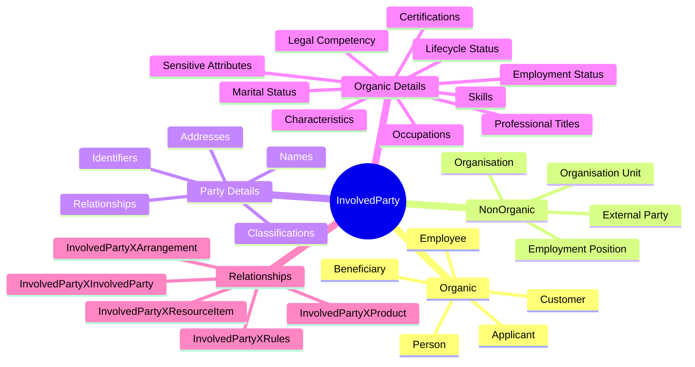
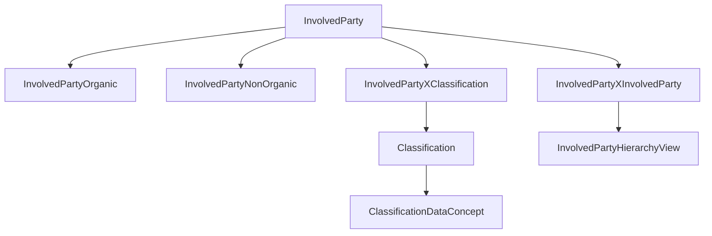

# 🧑‍🤝‍🧑 Involved Parties

> **An InvolvedParty is any person, organisation, organisational unit, position, counterparty, customer, employee, supplier, regulator, or other participant that ActivityMaster needs to know about.**

The Involved Party concept is the human and organisational side of the model. It is where ActivityMaster records **who** exists, **what kind of party they are**, **how they relate to other things**, and **which classifications describe their current business state**.

In plain human terms:

> _InvolvedParty is the shared party anchor._  
> _InvolvedPartyOrganic is a naturally occurring person._  
> _InvolvedPartyNonOrganic is an organisation, unit, position, or other constructed party._

This keeps the model simple enough to use in real systems, while still carrying the FSDM richness needed for a full canonical warehouse. 🌱

---

## ✨ Why Involved Parties Matter

Financial systems are full of participants:

- 👤 people who are customers, employees, applicants, beneficiaries, signatories, advisers, or contacts;
- 🏢 organisations that provide services, sell products, buy products, employ people, regulate activity, or enter arrangements;
- 🧱 organisational units such as branches, departments, teams, divisions, or subsidiaries;
- 💼 positions or roles that exist independently of the person currently occupying them;
- 🤝 party-to-party relationships such as employment, ownership, membership, customer relationships, department structures, and authority relationships;
- 🪪 names, identifiers, addresses, capabilities, statuses, qualifications, and other descriptors.

ActivityMaster keeps this manageable by combining a small number of stable entities with reusable classification concepts.

```text
Many old party-specific status/type tables
        ↓
InvolvedParty + Organic / NonOrganic specialisation
        ↓
InvolvedPartyXClassification + ClassificationID + Value
        ↓
Readable semantics without table explosion
```

---

## 🧠 Mental Model



---

## 🧱 ActivityMaster Implementation Shape

| Concern | ActivityMaster entity / relationship | Purpose |
|---|---|---|
| 🧑 Party anchor | `InvolvedParty` | Shared root for all party records. |
| 🌱 Natural person | `InvolvedPartyOrganic` | A person / individual party. |
| 🏢 Constructed party | `InvolvedPartyNonOrganic` | Organisation, organisational unit, position, or other non-person party. |
| 🏷️ Party type | `InvolvedPartyType` + `InvolvedPartyXInvolvedPartyType` | Classifies the broad kind of party. |
| 👤 Organic type | `InvolvedPartyOrganicType` | Classifies the kind of organic party where a dedicated type anchor is useful. |
| 🪪 Identification type | `InvolvedPartyIdentificationType` + `InvolvedPartyXInvolvedPartyIdentificationType` | Records party identifiers and the type of identifier used. |
| ✍️ Name type | `InvolvedPartyNameType` + `InvolvedPartyXInvolvedPartyNameType` | Records party names and the kind of name supplied. |
| 🧩 Flexible classifications | `InvolvedPartyXClassification` | Captures statuses, traits, skills, titles, sensitive attributes, reasons, and other descriptor values. |
| 🔁 Party relationships | `InvolvedPartyXInvolvedParty` | Relates one party to another party. |
| 🏠 Addresses | `InvolvedPartyXAddress` | Links a party to addresses and contact points. |
| 📦 Products | `InvolvedPartyXProduct` / `InvolvedPartyXProductType` | Links parties to products or product categories. |
| 🧰 Resource items | `InvolvedPartyXResourceItem` | Links parties to documents, assets, evidence, or supporting resources. |
| 📜 Rules | `InvolvedPartyXRules` | Links parties to policies, procedures, constraints, or rule sets. |
| 🌳 Hierarchy | `InvolvedPartyHierarchyView` | Presents party hierarchy and party-to-party structures. |
| 🔐 Security | `{Entity}SecurityToken` | Applies row-level access to party data and relationship rows. |

---

## 🧬 Core Entity Usage

### 🧑 `InvolvedParty`

`InvolvedParty` is the canonical party record.

It should be used whenever the system needs to identify a participant without first caring whether the participant is a person, organisation, department, employment position, regulator, vendor, customer, employee, or other party type.

Typical uses:

- a customer applying for a product;
- an employee participating in an arrangement;
- an organisation providing a service;
- a regulator referenced in a compliance process;
- a beneficiary named in an arrangement;
- a party that owns, manages, leases, pledges, or holds a resource item.

### 🌱 `InvolvedPartyOrganic`

`InvolvedPartyOrganic` represents a person.

A person is uniquely identifiable and distinct from other people. The person may be of interest because they are a customer, employee, applicant, beneficiary, signatory, owner, contact, adviser, or another party involved in the financial institution's activity.

Examples:

| Example | Meaning |
|---|---|
| John Smith | A person who may be a customer, employee, applicant, or signatory. |
| Jane Brown | A person who may be of interest for customer, employment, compliance, or arrangement reasons. |

### 🏢 `InvolvedPartyNonOrganic`

`InvolvedPartyNonOrganic` represents a constructed or non-person party.

Typical examples:

| Example | Meaning |
|---|---|
| Organisation | A company, public body, association, trust, partnership, or institution. |
| Organisation unit | A branch, division, department, team, or subsidiary. |
| Employment position | A defined position that may be occupied by different people over time. |
| External counterparty | A supplier, regulator, partner, intermediary, vendor, market participant, or service provider. |

> 🧭 Implementation note: this upload gives rich detail for organic/person modelling. Non-organic party detail should be completed from the organisation / employment position / party relationship source documents when those are added.

---

## 🔗 Classification and Value Pattern

Most party-specific detail should not become a dedicated table unless it has strong structural reasons to do so.

For flexible descriptors, statuses, and relationship meanings, use this pattern:

```text
InvolvedPartyXClassification
  InvolvedPartyID   = the party being described
  ClassificationID  = the semantic bucket / concept
  Value             = the assigned business value
```

Examples:

| Semantic need | ActivityMaster representation |
|---|---|
| A person is living | `InvolvedPartyXClassification` + `ClassificationID = InvolvedPartyLifeCycleStatuses` + `Value = Living Individual` |
| A person is employed | `InvolvedPartyXClassification` + `ClassificationID = InvolvedPartyEmploymentStatuses` + `Value = Employed Individual` |
| A person has an occupation | `InvolvedPartyXClassification` + `ClassificationID = InvolvedPartyOccupations` + `Value = Doctor` |
| A person has a skill | `InvolvedPartyXClassification` + `ClassificationID = InvolvedPartySkills` + `Value = Business Skills` |
| A person has a professional title | `InvolvedPartyXClassification` + `ClassificationID = InvolvedPartyProfessionalTitles` + `Value = Certified Public Accountant` |
| A person has a certification type | `InvolvedPartyXClassification` + `ClassificationID = InvolvedPartyCertificationTypes` + `Value = Industry Certification` |
| A person has a characteristic | `InvolvedPartyXClassification` + `ClassificationID = InvolvedPartyCharacteristics` + `Value = High Pitched Voice` |
| A person has a lifecycle change reason | `InvolvedPartyXClassification` + `ClassificationID = InvolvedPartyStatusChangeReasons` + `Value = Death Certificate Received` |

---

## 🪪 Names and Identifiers

Names and identifiers are common enough to keep dedicated type anchors in ActivityMaster.

| Need | ActivityMaster representation | Notes |
|---|---|---|
| Legal name | `InvolvedPartyXInvolvedPartyNameType` | `Value` can carry the name text or selected name value, depending on implementation shape. |
| Preferred name | `InvolvedPartyXInvolvedPartyNameType` | Useful for display and contact handling. |
| Trading / organisation name | `InvolvedPartyXInvolvedPartyNameType` | More relevant to non-organic parties. |
| National identifier | `InvolvedPartyXInvolvedPartyIdentificationType` | Sensitive; should be protected by security tokens. |
| Employee number | `InvolvedPartyXInvolvedPartyIdentificationType` | Useful for internal staff parties. |
| Customer number | `InvolvedPartyXInvolvedPartyIdentificationType` | Useful for customer master links. |
| External reference | `InvolvedPartyXInvolvedPartyIdentificationType` | Used for source-system alignment. |

> 🔐 Identification values are sensitive by default. Access should be explicit, tokenised, audited, and kept aligned with ActivityMaster row-level security.

---

## 🔁 Party-to-Party Relationships

Use `InvolvedPartyXInvolvedParty` when one party needs to be related to another party.

```text
InvolvedPartyXInvolvedParty
  InvolvedPartyID          = first party
  RelatedInvolvedPartyID   = second party
  ClassificationID         = InvolvedPartyRelationships
  Value                    = relationship meaning
```

Examples:

| Relationship value | Example meaning |
|---|---|
| `Is Employed By` | A person is employed by an organisation. |
| `Employs` | An organisation employs a person. |
| `Is Customer Of` | A person or organisation is a customer of another organisation. |
| `Is Department Of` | An organisation unit belongs to an organisation. |
| `Occupies Position` | A person occupies an employment position. |
| `Reports To` | A person, unit, or position reports to another party. |
| `Owns` | A party owns another party or legal structure where applicable. |
| `Is Contact For` | A person acts as a contact for another party. |

> 🧭 Implementation note: exact relationship values should be seeded as classifications under `InvolvedPartyRelationships` once the party relationship source document is available.

---

## 🌱 Organic Party Classification Concepts

The uploaded organic/person source contains a rich set of descriptors that should be represented as classification concepts and values.

### 🧬 `InvolvedPartyCharacteristics`

Used for inherent traits or aspects of a person. These may support identification, verification, or operational accommodation.

| Value | Description / example |
|---|---|
| `Individual Handwriting` | Handwriting-related characteristic. |
| `Individual Voice` | Voice-related characteristic; example value may be `High Pitched Voice`. |
| `Individual Physical Feature` | Physical feature such as height or eye colour. |

Suggested row pattern:

```text
InvolvedPartyXClassification
  ClassificationID = InvolvedPartyCharacteristics
  Value            = High Pitched Voice
```

### 🟢 `InvolvedPartyLifeCycleStatuses`

Represents the current or historical life state of a person.

| Value | Meaning |
|---|---|
| `Living Individual` | Person is currently known to be living. |
| `Missing Individual` | Person is missing. |
| `Deceased Individual` | Person is deceased. |

Example:

```text
InvolvedPartyXClassification
  ClassificationID = InvolvedPartyLifeCycleStatuses
  Value            = Living Individual
```

### 🧭 `InvolvedPartyStatusChangeReasons`

Explains why a lifecycle state changed.

| Value | Meaning |
|---|---|
| `Birth Certificate Received` | Birth or identity evidence received. |
| `Death Certificate Received` | Death evidence received. |
| `Customer Relationship Initiated` | Party relationship began. |
| `Missing Person Report Received` | Missing-person evidence received. |

Example:

```text
InvolvedPartyXClassification
  ClassificationID = InvolvedPartyStatusChangeReasons
  Value            = Death Certificate Received
```

### 💼 `InvolvedPartyEmploymentStatuses`

Represents how a person currently earns a living, with history preserved by SCD dates.

| Value | Meaning / example |
|---|---|
| `Employed Individual` | Person is employed. |
| `Not Employed Individual` | Person is not employed. |
| `Self Employed Individual` | Person earns a living through self-employment. |

Example:

> John Doe may be `Employed Individual` this year and `Not Employed Individual` in a previous effective period.

### ⚖️ `InvolvedPartyLegalCompetencyStatuses`

Represents the legal ability of a person to conduct business.

| Value | Meaning |
|---|---|
| `Minor` | Person is legally a minor. |
| `Adult` | Person is legally able to conduct business as an adult. |
| `Mentally Incompetent` | Person has a legal competency limitation. |
| `Senile` | Legacy value representing age-related competency concern; needs modern wording review. |
| `Alien` | Legacy value; needs jurisdictional and modern terminology review. |
| `Convict` | Legacy value; needs legal, privacy, and compliance review. |

> ⚠️ This concept is sensitive. It should be retained only where there is a lawful business reason and protected through row-level security.

### 💍 `InvolvedPartyMaritalStatuses`

Represents legal marital position at a point in time.

| Value | Meaning / example |
|---|---|
| `Divorced Individual` | Person is legally divorced. |
| `Married with Common Property` | Person is married under common-property rules. |
| `Married with Separated Property` | Person is married under separated-property rules. |
| `Separated Individual` | Person is legally separated. |
| `Unmarried Individual` | Person is not married. |
| `Widowed Individual` | Person is widowed. |

Example:

> A person may be `Married with Common Property` in one effective period, `Widowed Individual` in another, and later `Married with Common Property` again.

### 🧑‍🔧 `InvolvedPartyOccupations`

Represents a person's work or business experience. A person may have more than one occupation over time.

| Value | Meaning |
|---|---|
| `Author` | Author or writer. |
| `Business Owner` | Owner of a business. |
| `Consultant` | Consultant. |
| `Doctor` | Medical doctor. |
| `Dentist` | Dentist. |
| `Economist` | Economist. |
| `Finance` | Finance-related occupation. |
| `Homemaker` | Homemaker. |
| `Farmer` | Farmer. |
| `Free Professional` | Independent professional. |
| `Tradeperson` | Trade occupation; spelling should be confirmed before seed finalisation. |

Example:

> John Doe may have `Lawyer` effective from 1 June 1975 and `Accountant` effective from 10 May 1989.

### 🧠 `InvolvedPartySkills`

Represents abilities, competencies, and experience that a person has acquired through training, practice, or natural ability.

| Value | Meaning |
|---|---|
| `Analysis Skills` | Ability to examine a problem space and break it into simpler elements. |
| `Business Skills` | Ability to analyse information and apply it to financial activities such as trading or lending. |
| `Communication Skills` | Ability to impart or exchange information, such as speaking, listening, or writing. |
| `Interpersonal Skills` | Ability to foster good relationships with and among people. |
| `Management Skills` | Ability to conduct, direct, or supervise business actions. |
| `Marketing Skills` | Ability to research market characteristics and develop profitable offerings. |
| `Personal Computer Skills` | Demonstrated ability to operate a personal computer. |
| `Technical Skills` | Practical knowledge of a specific technique or field. |
| `Training Skills` | Ability to impart knowledge and instruct others. |

Examples:

| Person | Skill value |
|---|---|
| Mary Smith | `Business Skills` |
| Joyce Jones | `Marketing Skills` |

### 🎓 `InvolvedPartyCertificationTypes`

Represents official accreditation types for skills, professional titles, or positions.

| Value | Meaning / example |
|---|---|
| `Formal Examination` | Certification requiring successful completion of an examination set by a recognised body, excluding undergraduate or postgraduate study; for example, a school leaving certificate examination. |
| `Industry Certification` | Certification requiring completion of study conducted or authorised by an industry body; for example, a Graduate School of Banking diploma. |
| `Internal Training` | Training conducted by an organisation for its employees. |
| `Postgraduate Degree` | Course normally following an undergraduate degree; for example, a Masters Degree in Business Studies. |
| `Public Course` | Course of study conducted by a training company. |
| `Tertiary Degree` | Tertiary qualification category. |
| `Undergraduate Degree` | College or university undergraduate degree; for example, Bachelor of Applied Science. |

> ⚠️ `Tertiary Degree` and `Undergraduate Degree` need confirmation as either separate values or a consolidated seed value.

### 🧾 `InvolvedPartySkillCertifications`

Represents evidence that a skill has been certified.

Suggested simplified model:

```text
InvolvedPartyXClassification
  ClassificationID = InvolvedPartySkills
  Value            = Business Skills

InvolvedPartyXClassification
  ClassificationID = InvolvedPartySkillCertifications
  Value            = Undergraduate Degree
```

If supporting evidence is required, link a document or certificate through `InvolvedPartyXResourceItem`.

Example:

> A person may have `Business Skills` certified by `Undergraduate Degree`, and `Financial Consultant` certified by an internal certificate.

### 🏅 `InvolvedPartyProfessionalTitles`

Represents formal names or titles assigned to a person regardless of their position or product relationship.

| Value | Meaning |
|---|---|
| `Certified Public Accountant` | Formal accounting title. |
| `Certified Financial Planner` | Formal financial planning title. |
| `Attorney at Law` | Legal professional title. |
| `Doctor of Medicine` | Medical professional title. |
| `Doctor of Philosophy` | Academic professional title. |

Example:

> John Smith may have the professional title `Certified Public Accountant`.

### 🧾 `InvolvedPartyProfessionalCertifications`

Represents certification attached to a professional title.

Suggested simplified model:

```text
InvolvedPartyXClassification
  ClassificationID = InvolvedPartyProfessionalTitles
  Value            = Certified Public Accountant

InvolvedPartyXClassification
  ClassificationID = InvolvedPartyProfessionalCertifications
  Value            = Industry Certification
```

If the certificate itself needs to be retained, attach the evidence through `InvolvedPartyXResourceItem`.

---

## 🔐 Sensitive Organic Party Classifications

Some organic-party attributes are sensitive by nature. They may exist in the historical FSDM material, but they should not be casually exposed or required in application flows.

ActivityMaster should treat these as **optional, security-controlled classifications**.

### 🧬 `InvolvedPartyEthnicTypes`

| Value | Notes |
|---|---|
| `Hispanic` | Sensitive demographic classification. |
| `Polish American` | Sensitive demographic classification. |
| `Japanese American` | Sensitive demographic classification; spelling normalised from legacy material and should be confirmed. |
| `Swedish` | Sensitive demographic classification. |
| `Italian` | Sensitive demographic classification. |

### ⚧️ `InvolvedPartyGenderTypes`

| Value | Notes |
|---|---|
| `Female` | Sensitive personal attribute. |
| `Male` | Sensitive personal attribute. |

> ⚠️ The original values are binary. Modern implementation may require a richer, jurisdiction-aware, optional classification set.

### 🧬 `InvolvedPartyRaceTypes`

| Value | Notes |
|---|---|
| `Aboriginal` | Sensitive demographic classification. |
| `Black` | Sensitive demographic classification. |
| `Caucasian` | Sensitive demographic classification. |
| `Oriental` | Sensitive demographic classification; wording should be reviewed before use. |

### 🛐 `InvolvedPartyReligionTypes`

| Value | Notes |
|---|---|
| `Catholic` | Sensitive belief/affiliation classification. |
| `Protestant` | Sensitive belief/affiliation classification. |
| `Jewish` | Sensitive belief/affiliation classification. |
| `Islamic` | Sensitive belief/affiliation classification. |
| `Buddhist` | Sensitive belief/affiliation classification. |

### ♿ `InvolvedPartyDisabilityTypes`

| Value | Meaning |
|---|---|
| `Hearing Impaired` | Hearing limitation or accommodation need. |
| `Vision Impaired` | Vision limitation or accommodation need. |
| `Mentally Impaired` | Mental limitation; wording requires modern review. |
| `Physically Impaired` | Physical limitation or accommodation need. |
| `Unimpaired` | No known impairment. |

Example:

> A customer may be classified as `Hearing Impaired` so the organisation can provide suitable accommodation.

> 🔐 These values must be guarded by security and should only be captured when there is a lawful, explicit, and necessary business reason.

---

## 📎 Supporting Evidence and Documentation

Where a party descriptor depends on evidence, prefer linking the evidence rather than expanding the party model.

| Evidence need | ActivityMaster representation |
|---|---|
| Skill certificate document | `InvolvedPartyXResourceItem` |
| Professional title certificate | `InvolvedPartyXResourceItem` |
| Death certificate | `InvolvedPartyXResourceItem` + lifecycle/status change classification |
| Birth certificate | `InvolvedPartyXResourceItem` + lifecycle/status change classification |
| Disability accommodation evidence | `InvolvedPartyXResourceItem` with restricted security |
| Identity document | `InvolvedPartyXResourceItem` and/or `InvolvedPartyXInvolvedPartyIdentificationType` |

---

## 🌳 Hierarchy Strategy

Use `InvolvedPartyHierarchyView` and `InvolvedPartyXInvolvedParty` for structural relationships.

Use `ClassificationXClassification` for classification hierarchy.



Example classification hierarchy:

```text
InvolvedPartySkills
  ├── Business Skills
  ├── Communication Skills
  ├── Management Skills
  └── Technical Skills

InvolvedPartyCertificationTypes
  ├── Industry Certification
  ├── Internal Training
  ├── Public Course
  ├── Undergraduate Degree
  └── Postgraduate Degree
```

---

## ✅ What Is Handled

| FSDM need | ActivityMaster handling |
|---|---|
| Person as a party | `InvolvedParty` + `InvolvedPartyOrganic` |
| Organisation / unit / position as party | `InvolvedParty` + `InvolvedPartyNonOrganic` |
| Party type | `InvolvedPartyType`, `InvolvedPartyOrganicType`, `InvolvedPartyXInvolvedPartyType` |
| Names | `InvolvedPartyNameType`, `InvolvedPartyXInvolvedPartyNameType` |
| Identifiers | `InvolvedPartyIdentificationType`, `InvolvedPartyXInvolvedPartyIdentificationType` |
| Addresses / contact points | `InvolvedPartyXAddress` |
| Party descriptors and statuses | `InvolvedPartyXClassification` + concept/value pattern |
| Party-to-party relationships | `InvolvedPartyXInvolvedParty` |
| Products associated with parties | `InvolvedPartyXProduct`, `InvolvedPartyXProductType` |
| Resource/document evidence | `InvolvedPartyXResourceItem` |
| Rules / policies for parties | `InvolvedPartyXRules` |
| Security | `{Entity}SecurityToken` pattern |
| History | Standard SCD columns: `EffectiveFromDate`, `EffectiveToDate`, timestamps, active flag |

---

## 🧩 What Is Simplified

| Legacy-style structure | ActivityMaster simplification |
|---|---|
| Separate tables for each person status | `InvolvedPartyXClassification` with different `ClassificationID` buckets. |
| Separate tables for characteristics, disabilities, occupations, skills, titles, and certifications | One relationship pattern with `Value` and SCD dates. |
| Separate reason/status relationship tables | Use classification concepts such as `InvolvedPartyLifeCycleStatuses` and `InvolvedPartyStatusChangeReasons`. |
| Separate certification links for skill/title | Use classification rows plus optional `InvolvedPartyXResourceItem` evidence. |
| Dedicated sensitive-attribute type tables | Optional classification concepts with security and policy controls. |

This deliberately avoids creating a table for every human descriptor while preserving the business meaning. Calm, tidy, and still FSDM-aware. ✨

---

## ⚠️ Missing or Needs Confirmation

| Area | Status | Notes |
|---|---:|---|
| Non-organic party details | ⚠️ Needs source | Organisation, organisation unit, employment position, and non-person party structures need their own source pass. |
| Party relationship values | ⚠️ Needs source | Values such as `Is Customer Of`, `Is Employed By`, `Reports To`, and `Owns` should be confirmed from party relationship materials. |
| Name type values | ⚠️ Needs source | Legal name, preferred name, trading name, maiden name, etc. need a naming source. |
| Identification type values | ⚠️ Needs source | National ID, passport, tax number, employee number, customer number, registration number, etc. need a source. |
| Skill-to-certification instance link | ⚠️ Needs design decision | Current simplification can store both values, but exact correlation between a specific skill and a specific certification may need either metadata, value convention, or resource evidence. |
| Professional title-to-certification instance link | ⚠️ Needs design decision | Same as skill certification. |
| Sensitive attributes | ⚠️ Policy required | Race, religion, ethnicity, gender, disability, legal competency, and similar classifications must be optional, security-controlled, and jurisdiction-aware. |
| Modern terminology review | ⚠️ Needs confirmation | Values such as `Oriental`, `Alien`, `Senile`, `Mentally Impaired`, and `Tradeperson` need review before seed finalisation. |
| Binary gender model | ⚠️ Needs confirmation | Original values only provide `Female` and `Male`; modern implementation may require broader optional values. |
| `Tertiary Degree` vs `Undergraduate Degree` | ⚠️ Needs confirmation | Both appear in the semantic material and should be reconciled during seed creation. |

---

## 🧭 Recommended Seed Concepts

These `ClassificationDataConcept` names are implementation-friendly starting points.

| ClassificationDataConcept | Example values |
|---|---|
| `InvolvedPartyCharacteristics` | `Individual Voice`, `Individual Handwriting`, `Individual Physical Feature` |
| `InvolvedPartyDisabilityTypes` | `Hearing Impaired`, `Vision Impaired`, `Physically Impaired`, `Unimpaired` |
| `InvolvedPartyEmploymentStatuses` | `Employed Individual`, `Not Employed Individual`, `Self Employed Individual` |
| `InvolvedPartyEthnicTypes` | `Hispanic`, `Polish American`, `Japanese American`, `Swedish`, `Italian` |
| `InvolvedPartyGenderTypes` | `Female`, `Male` |
| `InvolvedPartyLifeCycleStatuses` | `Living Individual`, `Missing Individual`, `Deceased Individual` |
| `InvolvedPartyStatusChangeReasons` | `Birth Certificate Received`, `Death Certificate Received`, `Customer Relationship Initiated`, `Missing Person Report Received` |
| `InvolvedPartyLegalCompetencyStatuses` | `Minor`, `Adult`, `Mentally Incompetent`, `Senile`, `Alien`, `Convict` |
| `InvolvedPartyMaritalStatuses` | `Divorced Individual`, `Married with Common Property`, `Widowed Individual` |
| `InvolvedPartyOccupations` | `Author`, `Business Owner`, `Consultant`, `Doctor`, `Farmer` |
| `InvolvedPartySkills` | `Analysis Skills`, `Business Skills`, `Marketing Skills`, `Technical Skills` |
| `InvolvedPartyCertificationTypes` | `Industry Certification`, `Internal Training`, `Postgraduate Degree`, `Undergraduate Degree` |
| `InvolvedPartyProfessionalTitles` | `Certified Public Accountant`, `Attorney at Law`, `Doctor of Medicine` |
| `InvolvedPartyProfessionalCertifications` | `Industry Certification`, `Formal Examination`, `Postgraduate Degree` |
| `InvolvedPartyRaceTypes` | `Aboriginal`, `Black`, `Caucasian`, `Oriental` |
| `InvolvedPartyReligionTypes` | `Catholic`, `Protestant`, `Jewish`, `Islamic`, `Buddhist` |
| `InvolvedPartyRelationships` | `Is Employed By`, `Is Customer Of`, `Is Department Of`, `Occupies Position` |

---

## 🧪 Example Rows

### Person lifecycle status

| Column | Value |
|---|---|
| `InvolvedPartyID` | John Smith |
| `ClassificationID` | `InvolvedPartyLifeCycleStatuses` |
| `Value` | `Living Individual` |
| `EffectiveFromDate` | Date the status became effective |
| `EffectiveToDate` | End-of-time until replaced |

### Person occupation history

| Column | Row 1 | Row 2 |
|---|---|---|
| `InvolvedPartyID` | John Doe | John Doe |
| `ClassificationID` | `InvolvedPartyOccupations` | `InvolvedPartyOccupations` |
| `Value` | `Lawyer` | `Accountant` |
| `EffectiveFromDate` | `1975-06-01` | `1989-05-10` |

### Person skill with certification evidence

| Row | Entity | ClassificationID / relationship | Value |
|---|---|---|---|
| 1 | `InvolvedPartyXClassification` | `InvolvedPartySkills` | `Business Skills` |
| 2 | `InvolvedPartyXClassification` | `InvolvedPartySkillCertifications` | `Undergraduate Degree` |
| 3 | `InvolvedPartyXResourceItem` | Certificate document | Linked certificate evidence |

### Person-to-organisation relationship

| Column | Value |
|---|---|
| First party | Person |
| Second party | Organisation |
| `ClassificationID` | `InvolvedPartyRelationships` |
| `Value` | `Is Employed By` |

---

## 📌 Implementation Notes

- Prefer `InvolvedPartyXClassification` for flexible descriptors, statuses, sensitive classifications, skills, titles, and certification categories.
- Prefer dedicated ActivityMaster type entities only where they already exist and provide stable implementation value, such as `InvolvedPartyType`, `InvolvedPartyOrganicType`, `InvolvedPartyNameType`, and `InvolvedPartyIdentificationType`.
- Use `Value` for the assigned business meaning on relationship rows.
- Use SCD effective dates to preserve history instead of creating history-specific tables.
- Use `InvolvedPartyXResourceItem` for evidence and documentation rather than adding binary/document columns to party tables.
- Treat sensitive organic classifications as explicitly governed data, not casual profile attributes.
- Avoid reviving old table-per-status modelling unless a concept has real structural behaviour that cannot be represented safely with classifications.

---

## ✅ Documentation Checklist

Before this page is considered final:

- [x] Organic/person semantic values have been carried forward.
- [x] ActivityMaster entity names are used instead of old source names.
- [x] Classification concepts are expressed as `ClassificationID` buckets and `Value` meanings.
- [x] Sensitive attributes are highlighted as governed and optional.
- [x] Missing non-organic party coverage is called out explicitly.
- [x] Relationship, name, and identifier gaps are clearly marked.
- [ ] Organisation / non-organic source documents have been processed.
- [ ] Party relationship values have been seeded and confirmed.
- [ ] Sensitive concepts have policy and security guidance approved.
- [ ] Spelling and terminology review is complete for seed values.

