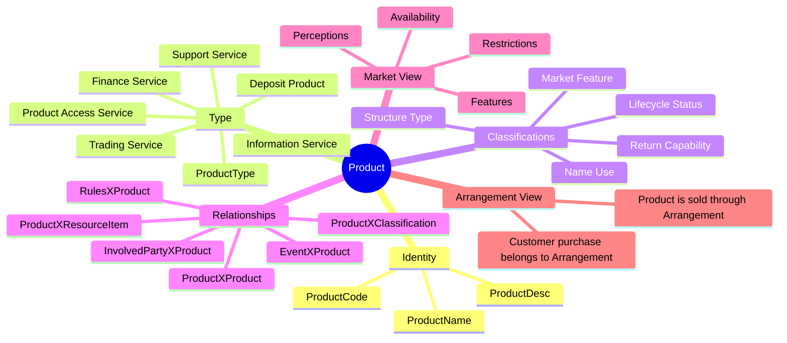

# 📦 Product

> **A Product is a good, service, financial offering, access channel, trading service, support service, or other marketable capability that can be offered, sold, purchased, maintained, or tracked by the financial institution.**

Products describe **what is available to the market** or **what the institution needs to understand about goods and services**. They are not the customer's executed contract. That belongs to **Arrangement**.

In plain terms:

> _Product describes the shelf item._  
> _Arrangement records the agreed deal._  
> _Rules describe the conditions under which the product can be structured, sold, purchased, or serviced._

This keeps Product focused on catalogue, capability, market, feature, lifecycle, and offering semantics. 🧭

---

## ✨ Why Products Matter

Financial institutions need to manage a broad range of products and services:

- 🏦 deposit products such as demand deposits and fixed term deposits;
- 💳 access products such as debit cards, credit cards, passbooks, drafts, and electronic access;
- 💰 finance services such as letters of credit, term loans, leases, and credit facilities;
- 📈 trading and financial market offerings;
- 🧾 information services such as account maintenance and reporting;
- 🛠️ support services such as advisory, maintenance, processing, and outsourcing services;
- 📣 market-facing names, features, perceptions, and availability;
- 📜 rules and conditions that define how products can be structured, sold, serviced, or purchased.

ActivityMaster keeps this shape flexible by using a small Product core plus reusable relationship tables and classification values.

```text
Many old product-specific relationship/type tables
        ↓
Product + ProductType + ProductX... relationships
        ↓
ClassificationID = semantic bucket
Value            = assigned business meaning / status / feature / role
        ↓
Full FSDM semantics without a table explosion
```

---

## 🧠 Mental Model



---

## 🧱 ActivityMaster Implementation Shape

| Concern | ActivityMaster entity / relationship | Purpose |
|---|---|---|
| 📦 Product anchor | `Product` | Canonical product, service, offering, or marketable capability. |
| 🏷️ Product type | `ProductType` + `ProductXProductType` | Classifies the inherent product family or product taxonomy. |
| 🌳 Product type hierarchy | `ProductTypeXClassification` / `ProductHierarchyView` | Supports grouped product families such as finance services, access services, trading services, and deposit products. |
| 🧩 Product classifications | `ProductXClassification` | Captures lifecycle status, structure type, return capability, market feature, name-use classification, and other product descriptors. |
| 🔁 Product-to-product | `ProductXProduct` | Models package products, product facilities, component products, and product hierarchy links. |
| 🧑 Product-to-party | `InvolvedPartyXProduct` | Links parties that own, manage, market, sell, supply, approve, design, develop, list, or otherwise participate in a product. |
| 📜 Product rules / conditions | `RulesXProduct` | Links product terms, eligibility rules, limits, prices, restrictions, and other reusable rules. |
| 🧰 Product resources | `ProductXResourceItem` | Links products to prospectuses, media releases, documents, resource items, and tangible/intangible objects represented by the product. |
| 🧾 Product events | `EventXProduct` | Links events that maintain, advertise, or affect products. |
| 🔐 Security | `{Entity}SecurityToken` | Applies row-level access to Product records and Product relationship rows. |

---

## 🧬 Core Entity Usage

### 📦 `Product`

`Product` is the canonical product or service record.

Use it for goods and services that can be offered, sold, purchased, maintained, compared, or otherwise tracked by the institution.

Typical examples:

| Example | Meaning |
|---|---|
| Private banking residential mortgage loan | A finance product or service offered by a financial institution. |
| Personal checking account | A demand deposit / account product. |
| Securities trading service | A trading service offered to customers or other involved parties. |
| Lockbox service | A named information or support service. |
| Letter of credit | A finance service product. |
| IBM common stock offering | A financial market offering that may later be represented as a ResourceItem when purchased or held. |

### 🏷️ `ProductType`

`ProductType` captures the major product taxonomy. Use `ProductType` and `ProductXProductType` for the inherent product family, rather than creating a physical table for every product type.

Examples:

```text
ProductXProductType
  ProductID     = the product
  ProductTypeID = Finance Service / Deposit Product / Trading Service / etc.
  Value         = optional qualifier where needed
```

### 🧩 `ProductXClassification`

Use `ProductXClassification` for product descriptors that classify the product but do not need their own physical table.

Examples:

| Semantic need | ActivityMaster representation |
|---|---|
| Product lifecycle | `ProductXClassification` + `ClassificationID = ProductLifeCycleStatuses` + `Value = Available Product` |
| Product structure | `ProductXClassification` + `ClassificationID = ProductStructureTypes` + `Value = Package Product` |
| Product return capability | `ProductXClassification` + `ClassificationID = ProductReturnCapabilities` + `Value = Interest Income` |
| Product market feature | `ProductXClassification` + `ClassificationID = ProductMarketFeatures` + `Value = No Prepayment Penalty` |
| Product market perception | `ProductXClassification` + `ClassificationID = ProductMarketFeaturePerceptions` + `Value = External Product Perception` |
| Product name use | `ProductXClassification` + `ClassificationID = ProductNameUseTypes` + `Value = Marketing Name` |

> 🧭 Implementation note: if Product market features or multiple Product names need independent history, comments, and a direct feature-to-perception link, they may need richer modelling later. For now, ActivityMaster can carry the semantic value through `ProductXClassification` and the relationship `Value` field.

---

## 🪪 Product Identity Columns

ActivityMaster keeps the primary Product identity deliberately simple.

| ActivityMaster column | Purpose |
|---|---|
| `ProductID` | Primary UUID identity of the Product. |
| `ProductName` | Main product name. |
| `ProductDesc` | Product description. |
| `ProductCode` | Short product code. |
| `effectiveFromDate` / `effectiveToDate` | SCD history period. |
| `warehouseCreatedTimestamp` / `warehouseLastUpdatedTimestamp` | Warehouse audit timestamps. |
| `activeFlagID` | Active / deleted / archived state. |
| `systemID` | Owning source system. |
| `enterpriseID` | Owning enterprise. |

Examples of values:

| Column | Example |
|---|---|
| `ProductName` | `Personal Checking Account` |
| `ProductDesc` | `Demand deposit account used for day-to-day transactions.` |
| `ProductCode` | `CHK001` |

---

## 🏷️ Product Types

Product types classify a product according to its characteristics and the market need it addresses.

### Market and investment products

| Product type | Meaning | Examples |
|---|---|---|
| `Financial Market Offering` | A financial instrument or financial-instrument arrangement available in the marketplace. | Stock offering of XYZ Corporation shares; commodity offering of pork bellies; currency offering of US Dollars; mineral-rights arrangement. |
| `Investment Product` | A product offering investment alternatives for income, appreciation, or other investment reasons. | Stocks, shares, property, mutual funds, insurance bonds, or combinations of these. |

### Deposit products

| Product type | Meaning | Examples |
|---|---|---|
| `Fixed Term Deposit` | A specified amount placed with the institution for a set period. | Overnight deposit; one-year time deposit. |
| `Demand Deposit` | A product used for day-to-day transactions and savings accumulation. | Demand deposit account; call account; checking account; savings account. |
| `Special Deposit` | Funds deposited under special legislation or rules. | Tax-advantaged deposits; government grant deposits; deposits with bonus lottery entry. |

### Product access services

| Product type | Meaning | Examples |
|---|---|---|
| `Debit Card Access` | Card access that allows debits to a customer account. | Card purchase debiting the card issuer account. |
| `Credit Card Access` | Card access using a line of credit offered by the issuer. | Credit card line access. |
| `Multiuse Card Access` | Card access enabling multiple services. | Credit line, account debit, ATM access, or other arranged uses. |
| `Electronic Access` | Access through an online system. | Computer terminal access; telephone access. |
| `Passbook Access` | Access using a uniquely identifiable book issued by the institution. | Passbook in which transactions are processed and recorded. |
| `Draft Access` | Access using a cheque or draft. | Checking account accessed by cheque. |

### Finance services

| Product type | Meaning | Examples |
|---|---|---|
| `Commercial Letter of Credit` | A letter of credit supporting buying or selling goods. | Export letter of credit. |
| `Line of Credit` | A credit facility with a predetermined borrowing limit. | Overdraft; commercial line of credit; revolving line of credit. |
| `Factoring` | Assignment of receivables to the institution for a discounted cash equivalent. | Receivables factored at a percentage below face value. |
| `Forfaiting` | Trade finance without recourse to the exporter / involved party. | Discounting a guaranteed bill of exchange for export trade. |
| `Preference Share Loan` | Corporate finance using redeemable preference share subscriptions. | Funding exchanged for preference share subscriptions with dividend-style interest. |
| `Shared Equity Loan` | Loan where appreciation of secured property is shared between borrower and lender. | Discounted mortgage rate in exchange for a percentage of sale profit. |
| `Standby Letter of Credit` | Letter of credit executed only if another business event does not occur. | Utility guarantee; bank guarantee. |
| `Term Loan` | Fixed-term lending for goods and services. | 48-month car loan; 15-year fixed-rate mortgage; 60-month equipment loan. |
| `Leasing` | Alternative to buying or borrowing, giving operating privileges without full ownership risk/reward. | Office equipment lease; car lease; boat lease; construction equipment lease. |

### Trading services and tangible goods

| Product type | Meaning | Examples |
|---|---|---|
| `Trading Service` | Service to facilitate or conduct buying, selling, or exchange on behalf of an involved party. | Buying or selling stock on behalf of a customer. |
| `Sale Trading Service` | Trading service for buying or selling an item. | Stock trading; commodity purchases. |
| `Repurchase Trading Service` | Trading contracts with a commitment to reverse the transaction later. | Repurchase agreement with future date and price. |
| `Exchange Trading Service` | Matching equal but opposite needs between involved parties. | Exchange fixed-rate borrowing against floating-rate borrowing. |
| `Rights Trading Service` | Trading rights to buy, sell, receive, or deliver goods at a specified price and time. | Option to buy £1,000,000 on a future date for Danish Kroner. |
| `Securities Lending Service` | Lending and borrowing securities, often to cover delivery short positions. | Borrowed securities while lender retains dividend and voting rights. |
| `Tangible Goods Product` | Tangible goods exchanged for value as part of normal business. | Coin, jewellery, car, furniture, or equipment trading. |

### Change services

| Product type | Meaning | Examples |
|---|---|---|
| `Check Cashing Service` | Exchange of a cheque for cash, often for a fee. | Payroll cheque drawn on one bank cashed at another bank. |
| `Cash Changing Service` | Exchange of denominations of the same currency, often for a fee. | One hundred dollar bill exchanged for smaller bills and coins. |

### Information services

| Product type | Meaning | Examples |
|---|---|---|
| `Account Maintenance` | Information management service that provides and maintains an accounting unit for an arrangement. | Account maintenance supporting a customer arrangement. |
| `Account Reconciliation Service` | Matching institution records against customer records. | Cheque sorting; cheque itemisation; accounting-unit balancing. |
| `Agent Service` | Intermediary transfer of information on behalf of an involved party. | Shipping documentation managed for export/import credit customers. |
| `Information Merchandising Service` | Parcel of data offered to a customer for analysis and manipulation. | Mailing list. |
| `Reporting Service` | Manipulates data and presents it to the customer. | Monthly statement; safe custody report; credit facility report; portfolio report; auditor's report. |

### Financial engineering services

| Product type | Meaning | Examples |
|---|---|---|
| `Financial Engineering Service` | Advice, research, management assistance, or funding for specialised financial activity. | Investment underwriting; mergers and acquisitions; financial planning. |
| `Issue Underwriting Service` | Administers buying a new issue from the issuer and selling it to the market. | Underwriting a new stock issue for a corporation. |
| `Mergers and Acquisitions` | Advises on or manages corporate merger, acquisition, or divestment. | Corporate reorganisation advisory. |
| `Syndicate Credit Engineering` | Arranges credit from a group of involved parties. | Syndicated loans, guarantees, or backup facilities. |
| `Project Financing` | Organises financial packages for complex long-term projects. | Feasibility studies, project management, and extension of credit. |
| `Financial Planning` | Advises individuals or companies on effective use of financial assets. | Personal or corporate financial planning. |

### Support services

| Product type | Meaning | Examples |
|---|---|---|
| `Support Service` | Labour and possibly facilities to assist an organisation in business operations. | Cheque-processing operations. |
| `Advisory Support Service` | Consultancy to help an involved party achieve goals. | Computer consultancy; outsourcing analysis; business policy analysis. |
| `Maintenance Service` | Keeps physical resources productive, repaired, and available. | Computer preventive maintenance; ATM inspection and repair; building repair. |
| `Processing Service` | Assists in processing operational activities. | Mortgage loan payment processing; cheque settlement; credit card processing. |

> 🌳 Hierarchy note: these product types should be loaded as a hierarchy, not as many physical tables. Parent concepts such as `Finance Service`, `Trading Service`, `Information Service`, and `Support Service` can group the leaf values through `ProductType` hierarchy or `Classification` hierarchy depending on implementation preference.

---

## 🧱 Product Structure Types

Product structure describes how a product stands alone or participates in a package/facility structure.

| Structure type | Meaning | Examples |
|---|---|---|
| `Single Product` | Can be sold independently of other products and may be related to product facilities. | Travellers cheque; interest-bearing deposit; personal loan. |
| `Package Product` | Made up of at least two single products and any number of facilities. | Multi-option facility including acceptance line of credit, letter of credit, and overdraft protection. |
| `Product Facility` | Has a price and conditions, but must be related to a single product or package product to be sold. | Statement facility sold only with an account-based product. |

ActivityMaster representation:

```text
ProductXClassification
  ProductID        = the product
  ClassificationID = ProductStructureTypes
  Value            = Single Product / Package Product / Product Facility
```

Product composition itself should use `ProductXProduct`:

```text
ProductXProduct
  ProductID        = package or parent product
  RelatedProductID = component product or facility
  ClassificationID = ProductCompositionRelationships
  Value            = Comprises / Includes / Requires / Is Facility For
```

> 🧩 Gap note: the exact `Value` list for `ProductXProduct` composition should be confirmed. The legacy source gives structure categories, but not a clean full product-to-product relationship value list in this extract.

---

## 🔄 Product Lifecycle Statuses

Product lifecycle statuses describe where the product is in its existence and market availability journey.

| Lifecycle value | Meaning | Examples |
|---|---|---|
| `Proposed Product` | Product is presented for consideration. | Proposal to offer a free checking account. |
| `Initial Feasibility Product` | Product concept is being analysed for viability. | Target market, economic factors, competitor position, and profit analysis. |
| `Under Development Product` | Product is being assembled and specifications / conditions are being defined. | Developing the product's features, pricing, or conditions. |
| `Rejected Product` | Product did not complete prerequisite activities and is not approved. | Developed investment service disallowed because it is unprofitable. |
| `Approved Product` | Product is accepted and can be made available for sale or further development. | Product confirmed and funded for development action. |
| `Submitted For Signoff Product` | Product is being assessed by parties required to accept or reject it. | Final review before acceptance or rejection. |
| `Release Pending Product` | Product is approved and waiting for rollout date. | New insurance service awaiting implementation after regulation takes effect. |
| `Announced Product` | Product has been made public. | Announced service to meet market needs. |
| `Rollout Product` | Prerequisite activities for sale availability are being carried out. | Initial marketing campaign and branch education. |
| `Available Product` | Product may be sold to customers. | Actively marketed annuity service. |
| `Temporarily Unavailable Product` | Product is withdrawn from market for a specified reason but not obsolete. | Travel service route suspended due to political tension but expected to resume. |
| `No Longer Available Product` | Product is no longer sold, but active arrangements may continue. | Free checking no longer offered, while existing active arrangements continue. |
| `Obsolete Product` | Product has been withdrawn and has no active arrangements. | Retired product with no active arrangement base. |

ActivityMaster representation:

```text
ProductXClassification
  ClassificationID = ProductLifeCycleStatuses
  Value            = Available Product
```

> 🧭 Semantic note: `Unknown` is mentioned as useful for competitor products, but it does not appear as a full lifecycle value with a definition in the domain list. Seed it only if the implementation needs explicit competitor / externally observed product tracking.

---

## 💸 Product Return Capabilities

Return capability describes the means by which a product can generate income, return, or payment.

| Return capability | Meaning | Examples |
|---|---|---|
| `Price Differential Income Product` | Return is based on the difference between cost to provide and price paid by customer. | Legal advice service charged at a fixed price per hour above delivery cost. |
| `Fee Income Product` | Return is based on predetermined fixed, variable, or sliding-scale charges. | Fixed fee for each money order sold. |
| `Interest Income` | Return is calculated as a percentage of the asset provided to the customer. | Loan return based on borrowed amount and lending rate. |
| `Non-return Capable Product` | Product does not directly produce income or return. | Personal savings account with no direct income to the institution. |
| `Rental Income Product` | Return is proportional to the time the customer uses the product. | Corporate cash-management service with PC rental and line charges. |

ActivityMaster representation:

```text
ProductXClassification
  ClassificationID = ProductReturnCapabilities
  Value            = Interest Income
```

---

## 🧑 Product and Involved Party Relationships

Product-to-party relationships identify who participates in the product lifecycle and product operation.

ActivityMaster uses `InvolvedPartyXProduct` for this relationship direction.

```text
InvolvedPartyXProduct
  InvolvedPartyID  = the party
  ProductID        = the product
  ClassificationID = ProductPartyRelationships
  Value            = Is Marketed By / Is Owned By / Is Managed By / etc.
```

| Relationship value | Meaning | Examples |
|---|---|---|
| `Has Development Funded By` | A party provides funds to develop a product. | Private corporation funds development of a product the institution will market. |
| `Has Primary Exchange Of` | A party provides the principal market for trading a product. | New York Stock Exchange as primary exchange for bonds or stocks. |
| `Is Approved By` | A party confirms sale or approval of a product. | Employee approves a commercial letter of credit. |
| `Is Declined By` | A party has been offered a product and refused it. | Offered product declined by a party. |
| `Is Designed By` | A party develops specifications for creating a product. | Bank specialist designs a payment services product. |
| `Is Developed By` | A party authors or builds a product. | Corporation develops a support services product. |
| `Is Intermediated By` | A third party helps link another party to the product. | Agent intermediates capital appreciation investment. |
| `Is Issued By` | A party issues the product. | Needs final definition text confirmed. |
| `Is Listed By` | A party lists and identifies a product. | Exchange lists securities offerings; brokerage lists property sales. |
| `Is Marketed By` | A party promotes the product. | Customer service representative markets automobile insurance for another management unit. |
| `Is Owned By` | A party legally owns or is responsible for the product. | Goods supplier owns a goods product. |
| `Has Prospective` | A party is expected to become a customer for the product. | Limited partnership is prospect for a deposit product. |
| `Is Sold By` | A party performs the actual sale. | Commodity exchange broker sells a commodity instrument. |
| `Is Managed By` | A party operates or manages the product. | Bank specialist manages a bridging loan. |
| `Is Supplied By` | A party acts as vendor or supplier. | Network service provider supplies a funds-transfer product. |

> ⚠️ Important modelling rule: a customer who purchases a product should normally be represented through **Arrangement** relationships, not as the party that owns or sells the product. The product-party relationship is for maintainers, managers, marketers, sellers, suppliers, issuers, designers, funders, or prospects around the product catalogue.

---

## 📜 Product Rules and Conditions

Product rules describe the conditions under which a product may be structured, sold, purchased, accessed, or serviced.

ActivityMaster uses `RulesXProduct` for this semantic area.

```text
RulesXProduct
  RulesID          = the reusable rule / condition
  ProductID        = the product
  ClassificationID = ProductRules
  Value            = Defines Product Condition / Eligibility / Limit / Feature Rule
```

Examples:

| Product rule example | Meaning |
|---|---|
| `Customer must be beyond the age of 55` | Eligibility condition for a product such as Club 55. |
| `Investor may reinvest dividend` | Condition of a common stock offering. |
| `Sinking fund is set aside to reduce an obligation` | Condition of a debenture debt offering. |
| `Initial Investment Amount >= R5,000.00` | Threshold condition. |
| `Grace Period = 15 days` | Time-period condition. |
| `Day of Month = 28th` | Scheduling condition. |
| `Interest Rate = 7% and Accounting Unit Balance = R10,000` | Statement condition. |
| `Face Value >= R100,000 and Face Value <= R200,000` | Range condition. |
| `Interest Rate = 7% or Interest Rate = 10%` | Matrix / alternative condition. |

> 🧩 Gap note: ActivityMaster has `Rules` and `RulesXProduct`, not a separate physical `Condition` entity. That is a reasonable simplification, but if strict FSDM condition reusability, condition nesting, matrix/range semantics, and expression evaluation become first-class requirements, `Rules` will need enough structure to support them clearly.

---

## 🌍 Product Availability and Location Semantics

Product location semantics describe where a product is offered or restricted.

| Relationship value | Meaning | Examples |
|---|---|---|
| `Is Offered At` | Product is made available only at specific locations. | SWIFT payment order offered at a city-centre bank location. |
| `Is Restricted In` | Product is prohibited from being sold in a location. | Consumer loan product banned in a particular region. |

Current ActivityMaster mapping options:

| Need | Current representation | Status |
|---|---|---|
| Product availability as a rule | `RulesXProduct` | ✅ Handled where geography is rule-based. |
| Product availability as a classification | `ProductXClassification` + `ClassificationID = ProductAvailability` + `Value = Is Offered At: North East Region` | 🟡 Simplified if no formal location entity is needed. |
| Product linked to a concrete address or geography entity | `ProductXAddress` / `ProductXGeography` | ⚠️ Missing from the current entity catalogue. |

> ⚠️ Gap note: if Product availability must link to formal `Address` or `Geography` records, add `ProductXAddress` and/or `ProductXGeography`, or make an explicit design decision to model location restrictions as `Rules` only.

---

## 📣 Product Market Features

A market feature is a perceived characteristic of a product with value for marketing, comparison, or customer understanding.

Examples of product market features:

| Feature value | Meaning / example |
|---|---|
| `Special Privileges` | Product carries special privileges. |
| `Statement` | Product includes or relates to statement functionality. |
| `No Prepayment Penalty` | Loan product has no prepayment penalty. |
| `Unlimited Checking` | Product includes unlimited cheque/checking activity. |
| `Quarterly Statements` | Product provides quarterly statement output. |
| `Twenty-four Hour Access` | Product provides round-the-clock access. |
| `Wire Transfer` | Product includes wire transfer capability. |

ActivityMaster representation:

```text
ProductXClassification
  ClassificationID = ProductMarketFeatures
  Value            = No Prepayment Penalty
```

Examples:

| Example | Meaning |
|---|---|
| Cash management terminal product + `Twenty-four Hour Access` | A product feature useful for market comparison. |
| Loan product + `No Prepayment Penalty` | A market-facing product attribute. |

### Product market feature perceptions

A market feature may be viewed differently by the institution, competitors, customers, or the market.

| Perception value | Meaning | Examples |
|---|---|---|
| `Internal Product Perception` | Feature viewed from the institution's point of view. | Product is marketable, profitable, or needed by a segment. |
| `External Product Perception` | Feature viewed from customer, competitor, or market perspective. | Product is convenient, low cost, safe, or quick to process. |

ActivityMaster representation:

```text
ProductXClassification
  ClassificationID = ProductMarketFeaturePerceptions
  Value            = External Product Perception
```

> 🧩 Gap note: the legacy semantics allow one market feature to have multiple specific perceptions. If the feature-perception link needs to be queried independently, a richer model may be needed. A simple `ProductXClassification` row can carry the values, but does not naturally express a direct feature-to-perception relationship unless encoded in `Value` or a structured rule/detail record.

---

## 🪪 Product Names and Name Uses

ActivityMaster has direct Product identity columns for the main product name, description, and product code.

| Product name concern | ActivityMaster representation | Status |
|---|---|---|
| Main name | `Product.ProductName` | ✅ Handled |
| Description | `Product.ProductDesc` | ✅ Handled |
| Short product code | `Product.ProductCode` | ✅ Handled |
| Multiple names by use | `ProductXClassification` + `ClassificationID = ProductNameUseTypes` + `Value` containing the use and/or assigned name | 🟡 Simplified |
| Historical independent product names | Dedicated Product name history relationship/entity | ⚠️ Missing if required |

Product name use values:

| Name use value | Meaning | Examples |
|---|---|---|
| `Common Product Name` | Familiar usage name. | Credit Card; Line of Credit; Investment Account. |
| `Generic Product Name` | Name for a whole product group. | Loans; deposits. |
| `Marketing Name` | Publicly recognised marketing label. | Retail Lending; Commercial Lending; Personal Checking. |
| `Product Mnemonic` | Short name or abbreviation. | `Retl Auto Ln` for Retail Automobile Loan. |
| `Product Trademark` | Legally protected product identification belonging to an involved party. | Protected product brand. |
| `Trading Product Name` | Name used to project image to the marketplace. | Market-facing trading label. |
| `Product Code` | Numeric or code identifier for one or more products. | Code `524` represents a specific product. |

Example:

```text
ProductXClassification
  ClassificationID = ProductNameUseTypes
  Value            = Marketing Name: VIP Checking
```

> 🧩 Gap note: if product names need their own independent SCD history, uniqueness, or multiple active names by purpose, a dedicated name/history structure may be cleaner than encoding names in `Value`.

---

## 🧰 Product and Resource Item Relationships

Product-resource relationships connect products to the tangible or intangible resources that they comprise, describe, or enable.

ActivityMaster representation:

```text
ProductXResourceItem
  ProductID        = the product
  ResourceItemID   = the resource item
  ClassificationID = ProductResourceItemRelationships
  Value            = Comprises / Is Described By
```

| Relationship value | Meaning | Examples |
|---|---|---|
| `Comprises` | The sale of a resource item is enabled by the development of a product. | Stationery and supplies comprise a supplies merchandise product; a transport vehicle comprises an equipment merchandise product. |
| `Is Described By` | Product is explained or described by a resource item. | Debenture described by a prospectus; information service described by a media release. |

---

## 🔁 Product-to-Product Relationships

Product-to-product links support package products, facilities, components, dependencies, and product hierarchy.

ActivityMaster representation:

```text
ProductXProduct
  ProductID          = parent / package / primary product
  RelatedProductID   = child / component / facility product
  ClassificationID   = ProductCompositionRelationships
  Value              = Comprises / Includes / Requires / Is Facility For
```

Useful examples:

| Product structure | Product-to-product meaning |
|---|---|
| Package product | Parent product includes multiple single products. |
| Product facility | Facility is available only with a single or package product. |
| Multi-option facility | Package includes acceptance line of credit, letter of credit, and overdraft protection. |
| Statement facility | Facility can only be sold with an account-based product. |

> ⚠️ Gap note: the current uploaded product source gives Product structure categories but does not provide a complete Product-to-Product relationship value list. The implementation should confirm the exact values to seed for `ProductCompositionRelationships`.

---

## 🧾 Product Events

Events can maintain, advertise, or affect products. This is handled through `EventXProduct` in the Event concept, but Product documentation should still point readers to the relationship.

Examples:

| Event relationship value | Meaning | Examples |
|---|---|---|
| `Maintains` | Event creates, modifies, deletes, or otherwise maintains a Product. | Maintenance entry updates the name of a product. |
| `Advertises` | Event makes information available to the public about a product or service. | Promotional message advertises a product. |
| `Affects` | Event has consequences that require a product change. | Regulation change affects a consumer loan product; explosion affects an insurance product; invention affects an equipment merchandise product. |

---

## ✅ What Is Handled in ActivityMaster

| FSDM semantic area | ActivityMaster handling | Status |
|---|---|---|
| Product core | `Product` with `ProductName`, `ProductDesc`, `ProductCode` | ✅ Handled |
| Product taxonomy | `ProductType`, `ProductXProductType`, `ProductTypeXClassification` | ✅ Handled |
| Product lifecycle | `ProductXClassification` + `ClassificationID = ProductLifeCycleStatuses` + `Value` | ✅ Handled |
| Product structure category | `ProductXClassification` + `ClassificationID = ProductStructureTypes` + `Value` | ✅ Handled |
| Product package / component links | `ProductXProduct` | ✅ Handled, values need final seed confirmation |
| Product return capability | `ProductXClassification` + `ClassificationID = ProductReturnCapabilities` + `Value` | ✅ Handled |
| Product-party role | `InvolvedPartyXProduct` + `ClassificationID = ProductPartyRelationships` + `Value` | ✅ Handled |
| Product-resource link | `ProductXResourceItem` + `ClassificationID = ProductResourceItemRelationships` + `Value` | ✅ Handled |
| Product rules / conditions | `RulesXProduct` | ✅ Handled with simplified condition model |
| Product market features | `ProductXClassification` + `ClassificationID = ProductMarketFeatures` + `Value` | ✅ Handled for simple features |
| Product market perceptions | `ProductXClassification` + `ClassificationID = ProductMarketFeaturePerceptions` + `Value` | 🟡 Simplified |
| Product event impact | `EventXProduct` | ✅ Handled in Events concept |
| Product security | `{Entity}SecurityToken` pattern | ✅ Handled |

---

## 🧩 What Is Simplified

| Legacy semantic area | ActivityMaster simplification |
|---|---|
| Product condition tables | Modelled as `RulesXProduct` instead of separate Product/Condition structures. |
| Product lifecycle status table | Modelled as classification rows rather than a dedicated lifecycle entity. |
| Product return capability table | Modelled as product classification rows. |
| Product market feature table | Modelled as product classification rows. |
| Product market feature perception table | Modelled as product classification rows; direct feature-to-perception link is simplified. |
| Product name and specific-name tables | Main name/code handled on `Product`; extra names can be represented using classification/value patterns if required. |
| Product structure type table | Modelled as classification rows plus `ProductXProduct` for actual package/component relationships. |
| Product-party relationship type table | Modelled as `InvolvedPartyXProduct` relationship values. |
| Product-resource relationship type table | Modelled as `ProductXResourceItem` relationship values. |

---

## ⚠️ Missing or Needs Confirmation

| Gap | Why it matters | Suggested decision |
|---|---|---|
| `ProductXAddress` / `ProductXGeography` | Product availability/restriction may need formal location links. | Add product-location relationships, or model availability entirely as Rules/Classifications. |
| Dedicated Product name history | Multiple names by purpose and time may need independent history. | Add a Product name structure only if `ProductName` + `ProductCode` + classification value is not enough. |
| Product market feature-to-perception link | One feature can be perceived internally and externally in different ways. | Use structured `Value`, a ResourceItem detail, or add a richer feature/perception model if needed. |
| Product-to-product relationship values | The product structure source gives categories but not a complete relationship value set. | Confirm seed values for `ProductCompositionRelationships`. |
| `Is Issued By` definition | Value appears in the product-party role list but lacks a clear definition in the extract. | Keep the value but mark the description as pending confirmation. |
| Competitor product lifecycle `Unknown` | Mentioned as useful, but not fully defined in the value list. | Seed only if competitor/external product tracking needs it. |
| Strict Condition expression support | Rules may need to represent thresholds, ranges, statements, and matrix conditions. | Ensure `Rules` can model structured expressions, not only text. |

---

## 🌱 Suggested Classification Data Concepts

These are suggested `ClassificationDataConcept` values to seed for Product.

| ClassificationDataConcept | Example values |
|---|---|
| `ProductTypes` | `Demand Deposit`, `Finance Service`, `Trading Service`, `Support Service` |
| `ProductStructureTypes` | `Single Product`, `Package Product`, `Product Facility` |
| `ProductLifeCycleStatuses` | `Proposed Product`, `Available Product`, `Obsolete Product` |
| `ProductReturnCapabilities` | `Interest Income`, `Fee Income Product`, `Rental Income Product` |
| `ProductPartyRelationships` | `Is Marketed By`, `Is Owned By`, `Is Managed By`, `Is Supplied By` |
| `ProductResourceItemRelationships` | `Comprises`, `Is Described By` |
| `ProductMarketFeatures` | `No Prepayment Penalty`, `Twenty-four Hour Access`, `Wire Transfer` |
| `ProductMarketFeaturePerceptions` | `Internal Product Perception`, `External Product Perception` |
| `ProductNameUseTypes` | `Marketing Name`, `Common Product Name`, `Product Mnemonic`, `Product Code` |
| `ProductAvailability` | `Is Offered At`, `Is Restricted In` |
| `ProductRules` | `Eligibility`, `Limit`, `Pricing`, `Restriction`, `Access Condition` |
| `ProductCompositionRelationships` | `Comprises`, `Includes`, `Requires`, `Is Facility For` |

---

## 🛠️ Developer Notes

1. **Do not model customer purchases as product-party ownership.**  
   Customer purchases belong to `Arrangement`, with links to Product and InvolvedParty.

2. **Use `ProductType` for the big taxonomy.**  
   The large product type tree should be hierarchical reference data, not a separate table per product category.

3. **Use `ProductXClassification` for descriptor-like product semantics.**  
   Lifecycle, structure, return capability, feature, perception, and name-use values can all live here unless they need independent entity behaviour.

4. **Use `RulesXProduct` for terms and conditions.**  
   Product constraints such as age eligibility, dividend reinvestment, sinking funds, thresholds, grace periods, and matrix/range conditions belong in Rules.

5. **Use `ProductXResourceItem` for documents and resource-backed product semantics.**  
   Prospectuses, media releases, information-service descriptions, and tangible goods relationships belong here.

6. **Keep product availability honest.**  
   If the system needs formal location links, the current entity catalogue has a gap. Do not hide this by overloading text values unless that is an explicit design choice.

---

## 🧭 Suggested Website Summary

Product is the ActivityMaster concept for modelling goods, services, financial offerings, market products, access services, information services, support services, trading services, and other capabilities that can be offered, sold, purchased, maintained, or tracked. ActivityMaster keeps Product intentionally compact by using `Product`, `ProductType`, reusable relationship tables, `ClassificationID`, and `Value` rather than recreating every legacy type table.

