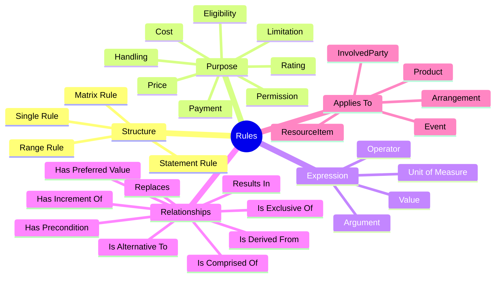

# 📏 Rules

> **Rules** describe reusable business requirements: limits, thresholds, eligibility criteria, prices, rates, permissions, timing controls, handling requirements, and other constraints that govern how business is conducted.

Rules are ActivityMaster's implementation shape for the requirement and constraint concepts in FSDM. They are deliberately broad: a rule can be a simple value test, a reusable term on a product, a limit on an arrangement, a prerequisite for another rule, or a structured expression made from smaller rules.

The goal is not to recreate every historical table one-for-one. The goal is to preserve the semantic richness of FSDM while using the ActivityMaster pattern:

```text
Rules / RulesType
  + ClassificationID = semantic bucket
  + Value            = assigned business meaning or relationship value
  + SCD columns      = effective history
  + SecurityToken    = row-level access
```

---

## 🧭 Why Rules Matter

Rules are where the model stores the business meaning behind statements like:

- initial investment amount must be at least `R5,000`;
- grace period is `15 days`;
- day of month is `28`;
- interest rate is `7%`;
- face value must be between `R100,000` and `R200,000`;
- eligibility for a senior citizen account requires age `>= 55`;
- a transaction processed after `3:00pm` must be applied to the next business day;
- an employment position may have authority to hire and fire employees;
- a credit risk rating may add five points if employment with the same employer exceeds three years.

Rules are intentionally reusable. A single rule such as `Length of Service >= 10 years` can be used as a prerequisite for vacation allowance, retirement benefits, promotion eligibility, or loan eligibility.

---

## 🧩 ActivityMaster Implementation Shape

| ActivityMaster element | Purpose |
|---|---|
| `Rules` | Stores the reusable rule set, rule statement, or business requirement. |
| `RulesType` | Classifies the main structural or implementation type of the rule. |
| `RulesXRulesType` | Links a rule to its structural rule type. |
| `RulesXClassification` | Applies semantic buckets such as lifecycle, purpose, argument, reference type, or measurement type. |
| `RulesXRules` | Links one rule to another, using `ClassificationID` for the relationship bucket and `Value` for the relationship meaning. |
| `RulesXArrangement` | Applies rules to arrangements. |
| `RulesXProduct` | Applies rules to products. |
| `RulesXInvolvedParty` | Applies rules to people, organisations, employment positions, or other involved parties. |
| `RulesXResourceItem` | Applies rules to documents, assets, instruments, or other resource items. |
| `RulesTypeXClassification` | Classifies available rule types. |
| `RulesTypeXResourceItem` | Links supporting documentation, specifications, examples, or rule artefacts to a rule type. |
| `RulesHierarchyView` | Supports hierarchical browsing of rules and rule groupings. |

### Standard columns

The main rule entity follows the ActivityMaster naming standard:

| Meaning | Column |
|---|---|
| Primary key | `RulesID` |
| Name | `RuleSetName` |
| Description | `RuleSetDescription` |
| Effective from | `EffectiveFromDate` |
| Effective to | `EffectiveToDate` |
| Owning enterprise | `EnterpriseID` |
| Active / deleted / archived state | `ActiveFlagID` |
| Owning system | `SystemID` |

Relationship tables use the standard relationship-table shape. `ClassificationID` identifies the semantic bucket, while `Value` stores the assigned business meaning, role, state, or relationship value.

---

## 🧠 Rule Mental Model



---

## 🧱 Rule Structure Types

Use `RulesXRulesType` for the primary structural type of a rule.

| `RulesType` value | Meaning | Example |
|---|---|---|
| `Single Rule` | A reusable atomic rule containing an argument, operator, value, and optionally a unit of measure. | `Interest Rate = 7%`; `Base Currency = Pound Sterling`; `Origination Fee = R180`. |
| `Statement Rule` | A rule built by combining two or more rules with logical `AND`. | `Interest Rate = 7%` AND `Accounting Unit Balance = R10,000`. |
| `Range Rule` | A rule that defines a boundary or valid set of values using minimum, maximum, increment, and optional preferred value rules. | Jumbo mortgage face value `>= R100,000` and `<= R200,000`, increment `R1,000`, preferred value `R150,000`. |
| `Matrix Rule` | A rule built from alternative statements, usually using logical `OR`. | `Interest Rate = 7% AND Balance < R100,000` OR `Interest Rate = 10% AND Balance >= R100,000`. |

---

## 🎯 Rule Purposes

Use `RulesXClassification` with `ClassificationID = RulePurposes` and `Value` set to the purpose.

| Value | Meaning | Example |
|---|---|---|
| `Cost Determination` | Determines cost, cost rate, or variables by which costs are derived. | Labour costs for check processing are `R10` per hour. |
| `Eligibility Determination` | Determines how qualification for something is achieved. | Eligibility age for senior citizen free checking is `age >= 55`; high-income segment selection uses `income > R150,000`. |
| `Handling Determination` | Expresses how an activity must be carried out without prescribing a full procedure or schedule. | A money transfer must be confirmed by SWIFT; a transaction after `3:00pm` applies to the next business day. |
| `Limitation Determination` | Specifies allowable limits, exceptions, and tolerance ranges. | Bankcard drawing may not exceed `R5,000`; a trading position of 100 million DMarks may be exceeded by `2%` during one trading day. |
| `Payment Determination` | Describes a remittable transaction to be made to an involved party. | Dividend payment of `R30.00` per share; monthly loan instalment into account `#76326894` at branch `#7424`. |
| `Permission Determination` | Grants discretionary privilege or authorisation. | Draws allowed against today's deposits = `yes`; an employment position has authority to hire and fire employees. |
| `Price Determination` | States a price, rate, fee, tax, exchange rate, or variable by which price is derived. | Interest rate of `10%` per annum; check processing fee of `20 cents` per check. |
| `Rating Determination` | Defines derivation of a score, rating, or scalar estimate. | Credit-risk rule adds five points if employment with the same employer exceeds three years. |

---

## 🧮 Rule Arguments

Use `RulesXClassification` with `ClassificationID = RuleArguments` and `Value` set to the argument. The argument is the subject of the rule expression.

| Value | Meaning / example |
|---|---|
| `Collateral` | Amount of collateral required to support an arrangement. |
| `Identification Type` | Accepted means of verifying authenticity, such as fingerprint or employee ID card. |
| `Calendar Basis` | Number of days used for accrual calculations: 360, 365, or 366 days per year. |
| `Medium` | Mode of an object or process, such as electronic payment or paper documentation. |
| `Increment` | Allowed change step, such as an interest-rate increment of `0.5%`. |
| `Average Accounting Unit Balance` | Average amount derived from a set of accounting-unit balances. |
| `Disclosure` | Whether associated information can be divulged under business guidelines. |
| `Anonymity` | Whether identity must be hidden; for example, `Anonymity = Required`. |
| `Face Value` | Nominal value of an instrument; for example, commercial paper face value of `$1 million`. |
| `Accounting Unit Balance Amount` | Controls permitted amount for an accounting-unit balance; for example, employee count cannot be negative. |
| `Accounting Unit Balance Nature` | Balance type used in a rule, such as ledger balance or collected funds. |
| `Frequency Cycle` | Recurring time span, such as daily electronic transmissions or bi-weekly employee payments. |
| `Length of Service` | Continuous employment duration; for example, loan eligibility requires length of service `> 5 years`. |
| `Margin Rate` | Differential between base/pegged rate and final rate; for example, margin rate `= 1.75%` over LIBOR. |
| `Initial Payment` | Amount deposited or borrowed to qualify for an arrangement. |
| `Origination Fee` | Amount charged for initially granting a service. |
| `Purchase Price` | Amount charged for goods; for example, a car priced at `R220,000` or a check book at `R20.00`. |
| `Report Content Footer` | Literal report footer label. |
| `Report Format Bottom Margin` | Bottom margin expressed as number of blank lines. |
| `Report Format Column Width` | Column width for a document/report. |
| `Report Format Number of Columns` | Number of vertical report sections. |
| `Report Format Number of Rows` | Number of horizontal report sections. |
| `Day of Month` | Calendar day used in a rule. |
| `Time of Day` | Time-based rule parameter. |
| `Item Processing Fee` | Fee charged for processing an item. |
| `Arrangement Financial Status` | Resultant arrangement financial state when other rule conditions are met. |
| `Base Currency` | Monetary unit used as the basis of a process or agreement. |
| `Data Stale Period` | Time span during which generated information remains accurate or usable. |
| `Expiration Period` | Time after which an offer, check, contract, or similar item is no longer valid. |
| `Fee Rate Basis` | Basis used to derive a fee rate. |
| `Grace Period` | Time allowed between due date and penalty. |
| `Interest Rate` | Time value of money. |
| `Address / Geography Identifier` | Place-based criterion. Use `Address` for concrete/contact/logical addresses and `Geography` for regions, jurisdictions, and bounded areas. |
| `Maturity` | Actions at maturity of an arrangement or plan, such as reinvestment, renegotiation, or repayment. |
| `Utilization` | How something may be used; for example, `Utilization = Deposit Only`. |
| `Appeal Period` | Time allowed to contest an action or state. |
| `Cancellation Period` | Time allowed for an involved party to cancel an arrangement or action. |
| `Access Method` | Means of access, such as `Access Method = PIN`. |
| `Uncleared Funds Acceptance` | Time taken for funds drawn on another financial institution to be credited. |

---

## 🔢 Rule Operators and Values

A single rule is conceptually made of:

```text
Argument + Operator + Value + optional UnitOfMeasure
```

Examples:

| Argument | Operator | Value | Unit / qualifier |
|---|---:|---|---|
| `Base Currency` | `=` | `Pound Sterling` | - |
| `Margin Rate` | `=` | `3` | `%` |
| `Origination Fee` | `=` | `180` | `R` |
| `Face Value` | `>=` | `R100,000` | currency amount |
| `Face Value` | `<=` | `R200,000` | currency amount |
| `Location Identifier` | `=` | `Mexico` | map to `Geography` |
| `Application Date` | `<` | `February 1998` | date value |

Supported operator values from the source semantics:

```text
=, >, <, <=, >=, <>
```

### Implementation note

The current `Rules` column standard does not yet expose dedicated `operator`, `ruleValue`, `argument`, or `unitOfMeasure` columns. Until that is added, implementations can store the human-readable rule in `RuleSetDescription` and use `RulesXClassification` / `RulesXRulesType` for its type metadata. A stricter executable-rule implementation should add explicit expression columns or a structured rule payload.

---

## 🧭 Rule Reference Types

Use `RulesXClassification` with `ClassificationID = RuleReferenceTypes`.

| Value | Meaning | Example |
|---|---|---|
| `Derived Rule` | Business requirement can be derived from other model information. | `Age = 65` derived from date of birth. |
| `Literal Rule` | Business requirement is expressed as a literal string not stored elsewhere. | `Report Content Footer = July Draft`. |
| `Model Based Rule` | Business requirement references another model attribute or entity concept. | `Location = 2 Main Street`; `Base Currency = Pound Sterling` referencing a unit name. |

---

## 📐 Measurement and Unit Handling

Use `RulesXClassification` with `ClassificationID = RuleMeasurementTypes`.

| Value | Meaning | Example |
|---|---|---|
| `Not Measurable` | The value is expressed without a unit of measure. | `Application Date < February 1998`. |
| `Qualified` | The value is given further meaning by a unit of measure. | `Margin Rate = 3%`; `Origination Fee = R180`. |

Unit examples include `Rand`, `Kilometer`, `Liters`, `U.S. Dollars`, and `Shares`. Compound examples include `Kilometers per hour` and `number of items per hour`.

### Gap

ActivityMaster does not currently list a dedicated `UnitOfMeasure` entity in the core entity catalogue. Unit-of-measure support should either be seeded as classifications or added as a dedicated reusable entity if executable rule evaluation requires strict dimensional handling.

---

## 🔁 Rule-to-Rule Relationships

Use `RulesXRules` with `ClassificationID = RuleRelationships` and `Value` set to the relationship meaning.

| Value | Meaning | Example |
|---|---|---|
| `Has Precondition` | One rule is a prerequisite for another. | Ten free checks per month has precondition of maintaining monthly balance of at least `R1,000`. |
| `Has Preferred Value` | A recommended value exists within a range. | Interest-rate range `7.0, 7.5, 8.0, 8.5` has preferred value `8.0%`. |
| `Has Increment Of` | A range changes by a defined increment. | Interest-rate range changes in increments of `0.5%`. |
| `Is Alternative To` | One rule may be substituted for another. | Origination fee of `R100` is alternative to `1%` of loan amount. |
| `Is Comprised Of` | A structured rule contains another rule. | A range is comprised of a minimum value. |
| `Is Derived From` | One rule is based on another. | Interest rate `9.0%` is derived from prime rate `7.0%`. |
| `Is Exclusive Of` | Either rule may be used, but not both together. | Two mutually exclusive fee rules. |
| `Replaces` | One rule replaces another. | Product interest rate `7%` replaces product interest rate `8%`. |
| `Results In` | One rule determines the outcome of another. | Writing more than ten checks in one month results in an activity fee of `R15.00`. |

---

## 🚦 Rule Lifecycle

Use `RulesXClassification` with `ClassificationID = RuleLifeCycleStatuses`.

| Value | Meaning |
|---|---|
| `Proposed Rule` | The rule is being formulated. |
| `Under Development Rule` | The rule has been formulated and is being developed/tested, but is not enacted in production business processes. |
| `Active Rule` | The rule is implemented and intended to be tested by, or incorporated into, at least one business process. |
| `Terminated Rule` | The rule previously existed in another state and was later discontinued intentionally. |

ActivityMaster SCD columns provide temporal validity through `EffectiveFromDate` and `EffectiveToDate`, so lifecycle history should be modelled as classification history rather than separate lifecycle tables.

---

## 🔗 Cross-Domain Application Pattern

Rules can apply across the model. Use the domain relationship table that matches the business object being governed.

| Business meaning | ActivityMaster representation |
|---|---|
| Rule governs an arrangement | `RulesXArrangement` or `ArrangementXRules` with `ClassificationID = ArrangementRuleRoles`, `Value = <relationship meaning>` |
| Rule defines a product term | `RulesXProduct` with `ClassificationID = ProductRuleRoles`, `Value = Product Term` |
| Rule restricts product availability | `RulesXProduct` plus `RulesXClassification` for purpose / limitation semantics. Use `Geography` where the rule is regional. |
| Rule applies to an involved party | `RulesXInvolvedParty` with a role value such as eligibility, authority, or restriction. |
| Rule references a document, instrument, or asset | `RulesXResourceItem` with `Value` describing the documentation or resource relationship. |
| Rule is triggered or maintained by an event | `EventXRules` with `ClassificationID = EventRuleRelationships`, `Value = Maintains` or `Is Controlled By`. |

---

## ✅ What Is Handled

| Requirement | Handled by |
|---|---|
| Reusable business requirements | `Rules` |
| Rule type / structure | `RulesType`, `RulesXRulesType` |
| Rule purpose | `RulesXClassification` with `RulePurposes` |
| Rule argument / topic | `RulesXClassification` with `RuleArguments` |
| Rule lifecycle | `RulesXClassification` with `RuleLifeCycleStatuses` plus SCD dates |
| Rule-to-rule composition | `RulesXRules` |
| Cross-domain rule assignment | `RulesXArrangement`, `RulesXProduct`, `RulesXInvolvedParty`, `RulesXResourceItem`, `EventXRules` |
| Supporting documentation | `RulesXResourceItem`, `RulesTypeXResourceItem` |
| Hierarchical browsing | `RulesHierarchyView` |
| Row-level security | `{Entity}SecurityToken` pattern |

---

## 🧩 What Is Simplified

| Original semantic shape | ActivityMaster simplification |
|---|---|
| Separate lifecycle status entity | Classification bucket on `Rules` plus SCD dates. |
| Separate purpose entity | `RulesXClassification` with `ClassificationID = RulePurposes`. |
| Separate argument entity | `RulesXClassification` with `ClassificationID = RuleArguments`. |
| Separate structure subtype tables | `RulesType` / `RulesXRulesType` plus classification metadata. |
| Separate unit-of-measure relationship | Classification value or future dedicated unit model. |
| Separate rule relationship table | `RulesXRules` with `ClassificationID = RuleRelationships` and relationship `Value`. |

---

## ⚠️ Missing or Needs Confirmation

| Gap | Why it matters | Suggested resolution |
|---|---|---|
| Explicit rule expression columns | Needed for executable rules, not just descriptive rules. | Add fields or a structured payload for `argument`, `operator`, `ruleValue`, and optional `unitOfMeasure`. |
| Unit-of-measure model | Qualified numeric rules need dimensional meaning. | Seed units as classifications first; add a dedicated entity only if calculations require it. |
| Rule parser / evaluator | Rules such as ranges, matrices, and statements need evaluation semantics. | Keep documentation semantic for now; implement evaluator separately. |
| Address / Geography reference handling | Place-based rule arguments need the new ActivityMaster split. | Use `Address` for concrete/logical address values and `Geography` for regions, jurisdictions, or bounded places. |
| Rule hierarchy semantics | `RulesHierarchyView` exists, but the exact parent/child classification values need confirmation. | Seed `RuleHierarchyRelationships` with values like `Is Comprised Of`, `Has Precondition`, and `Results In`. |
| Cross-domain direction consistency | Some relationships exist in both directions across the entity catalogue. | Prefer the entity listed in `Entities.md`; document aliases only in implementation notes, not website copy. |

---

## 🛠️ Developer Notes

- Use `Rules` for the rule itself, not for the thing the rule applies to.
- Use `RulesX...` tables to apply a rule to an arrangement, product, involved party, event, or resource item.
- Use `RulesXRules` to compose complex rules from smaller reusable rules.
- Use `ClassificationID` as the semantic bucket and `Value` as the assigned meaning.
- Keep rule descriptions readable even if a future executable-rule representation is added.
- Avoid over-normalising until there is a real need for calculation, validation, or rule execution.

---

## 🌱 Suggested Seed Classification Concepts

| Concept | Example values |
|---|---|
| `RulePurposes` | `Cost Determination`, `Eligibility Determination`, `Handling Determination`, `Limitation Determination`, `Payment Determination`, `Permission Determination`, `Price Determination`, `Rating Determination` |
| `RuleArguments` | `Interest Rate`, `Grace Period`, `Face Value`, `Base Currency`, `Maturity`, `Access Method`, `Frequency Cycle`, `Address Identifier`, `Geography Identifier` |
| `RuleStructureTypes` | `Single Rule`, `Statement Rule`, `Range Rule`, `Matrix Rule` |
| `RuleReferenceTypes` | `Derived Rule`, `Literal Rule`, `Model Based Rule` |
| `RuleMeasurementTypes` | `Not Measurable`, `Qualified` |
| `RuleLifeCycleStatuses` | `Proposed Rule`, `Under Development Rule`, `Active Rule`, `Terminated Rule` |
| `RuleRelationships` | `Has Precondition`, `Has Preferred Value`, `Has Increment Of`, `Is Alternative To`, `Is Comprised Of`, `Is Derived From`, `Is Exclusive Of`, `Replaces`, `Results In` |

---

## 🧾 Website Summary

Rules capture the reusable requirements, constraints, limits, thresholds, prices, permissions, and eligibility criteria that govern business behaviour in ActivityMaster. They can be simple atomic values, structured ranges, combined statements, or matrix-style alternatives. Rules can be linked to products, arrangements, events, involved parties, and resource items, while classifications describe their purpose, structure, lifecycle, and relationship meaning.
